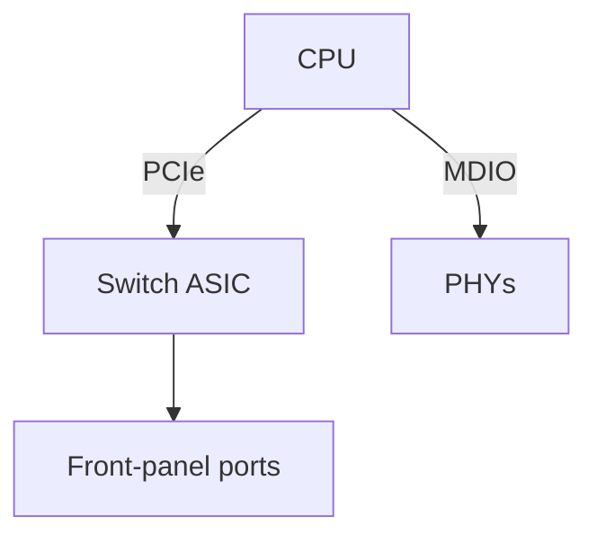
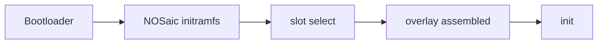

# <Board> — hardware reference

> Delete this line when the page is filled in.

The deep page: how this switch is built and how NOSaic drives it. The audience
is somebody changing the datapath or debugging silicon, not somebody installing.

**What belongs here:** the board as NOSaic understands it — block diagram, boot
chain, port map, the register regions our code touches, the quirks that cost
somebody a day.

**What does not:** the *investigation*. Traces, hypotheses, eliminated leads and
anything vendor-derived live in this board's reverse-engineering repository,
linked from the board's README. Vendor SDK source is never copied in; reference
it by `file:line`. A register table transcribed from a vendor header is that
vendor's, not ours — describe what our code does with the region instead.

## At a glance

| | |
|---|---|
| ASIC | |
| CPU / arch | |
| RAM | |
| Front panel | |
| Management | |
| Bootloader | |
| Console | |

## Block diagram

Replace with this board's real topology: how the CPU reaches the ASIC, what sits
on i2c/MDIO, where the CPLD is, how the management port is wired.

## Boot chain

Each hand-off, and what has to be true for it to happen.

## Port map

How front-panel names become physical and ASIC ports. This is the *only* place
that translation is defined. If the rule differs between cage types, say so
loudly — a single wrong assumption here presents as a dead port rather than as
a wrong index.

## Register and memory regions

The regions NOSaic touches, what it uses each for, and anything surprising about
access to them: width, ordering, a path that silently drops writes, a block that
must be brought up before another answers.

## Datapath

How `nosd-<asic>` drives the chip, and which `switch-api` capabilities this
board advertises — and which it does not, and why.

## Platform HAL

Sensors, fans, PSUs, LEDs, transceiver EEPROM: where each is read, and the
bounds on reading it.

## Quirks

The highest-value section, and the reason this page exists. One entry per hard-
won fact: what happens, why, and what to do. Each one is somebody's afternoon.

## Reverse engineering

Link the repository. Say what is in it that is not here, and whether it is
public.
