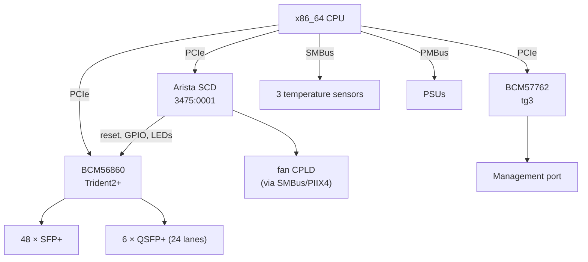
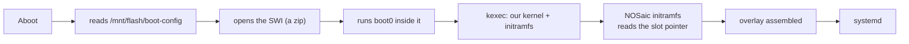

# Arista 7050SX2-72Q — hardware reference

How the box is built and how NOSaic will drive it. The investigation that
produced these facts lives in a private reverse-engineering repository; what is
here is what somebody changing NOSaic's datapath or debugging a port needs.

> **Nothing below has been exercised by NOSaic.** It is written from work done
> on this switch under EOS and from its own flash. Treat it as a map, not as a
> record of something that booted.

## At a glance

| | |
|---|---|
| ASIC | Broadcom BCM56860 (Trident2+), PCI `14e4:b860` |
| CPU / arch | x86_64 |
| Front panel | 48 × SFP+ (10G), 6 × QSFP+ (40G) — 72 × 10G, 24 QSFP lanes |
| Management | BCM57762, PCI `14e4:1682`, `tg3` |
| Board controller | Arista SCD, PCI `3475:0001` at `05:00.0` |
| Bootloader | Aboot; unsigned SWIs, `boot0` is a shell script |
| Console | ttyS0 @ 9600 |
| Board data | `prefdl`, SID `PortolaSPlus`, HwEpoch 1 |

## Block diagram

The SCD is the piece with no mainline equivalent. It is a PCI-enumerated board
controller, and ASIC reset, GPIO and LEDs go through it — so it has to be
brought up before the ASIC answers.

## Boot chain

Two things make this work without touching Aboot. The SWI carries `BLESSED=1`,
which is what lets Aboot boot an image with no signature, and
`SWI_MAX_HWEPOCH=1`, which this board's epoch does not exceed. Every member of
the archive is **Stored**, not deflated, with `version` first — matching the
vendor's own SWIs, from which this was read.

A/B slot selection is not Aboot's problem: NOSaic's initramfs reads the pointer
from its own boot partition, exactly as it does under GRUB or U-Boot.

## Port map

**The rule differs between cage types, and this is the trap.**

- For the **48 SFP+** ports, the SDK's physical port index *is* the RX lane.
- For the **24 QSFP lanes** it is not — there it follows the cage's subport.

Code that assumes one rule for both mis-maps two thirds of the QSFP capacity.
The symptom is a dead port, not an obviously wrong index, so it reads as a
hardware or optics fault and gets debugged in the wrong place. The board's own
`prefdl`/FDL board description carries the per-port lane map; derive from it
rather than by hand.

## Register and memory regions

The SCD is mapped from its PCI BAR and exposes board control — ASIC reset,
GPIO, LED state. The ASIC is reached over S-Channel through the CMIC once it is
out of reset and the PCI device has been rescanned.

Specific offsets and the register database belong to the reverse-engineering
repository and to Broadcom's SDK respectively. NOSaic references the SDK by
`file:line` and copies none of it: a register table transcribed from a vendor
header is that vendor's, and an image containing it could not be published.

## Datapath

`nosd-td2p` will drive the chip through the OpenBCM SDK — `sdk-6.5.27` carries
BCM56860 with a full register and memory database. That is a deliberate choice:
the licence permits distribution, so the resulting image is shippable, and the
SDK path is the one already proven to bring this chip to forwarding.

It implements `switch-api`; it does not get to change it. Where the chip cannot
do what the contract describes, it says so through the capability model.

## Platform HAL

What is known to work, and what is not:

| | |
|---|---|
| Temperature | Three sensors over SMBus — read correctly, matching EOS |
| PSU presence | Works |
| PSU status | Works over PMBus, and identifies a failed supply |
| Fans | **Reachable only with `CONFIG_I2C_PIIX4`**, and readings are not trustworthy |

**Do not drive the fans.** There is no reliable fan reading on this board, so a
control loop built on it would be a control loop built on noise — on hardware
whose thermal failure mode is silent.

## Quirks

- **Everything proven so far was proven after `kexec` from EOS**, and `kexec`
  resets the SerDes here. Booting standalone from Aboot leaves the chip in a
  different state, so prove standalone boot before the datapath work depends on
  it.
- **The SCD must be up before the ASIC answers.** Reset is released through it.
- **Fan readings are garbage.** See above.

## Reverse engineering

A private repository, outside this tree and not published. It holds the traces,
the eliminated hypotheses and the vendor-derived material that cannot ship. This
page is the part that is NOSaic's own.
