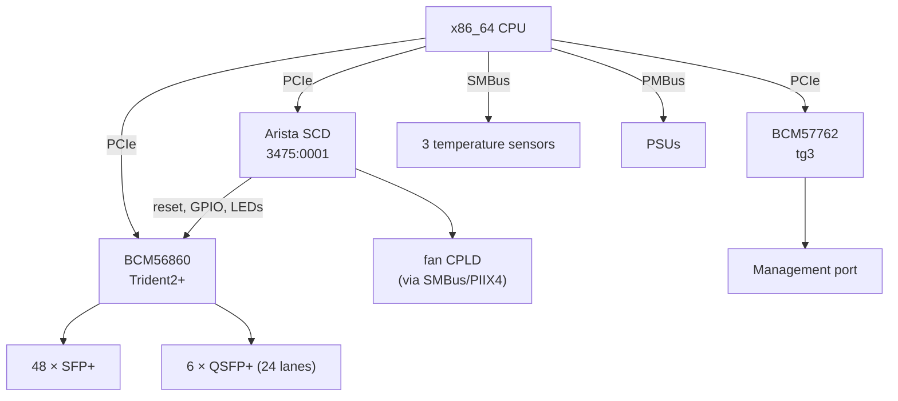
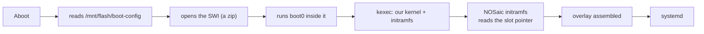

# Arista 7050SX2-72Q — hardware reference

How the box is built and how NOSaic will drive it. The investigation that
produced these facts lives in a private reverse-engineering repository; what is
here is what somebody changing NOSaic's datapath or debugging a port needs.

> **Nothing below has been exercised by NOSaic.** It is written from work done
> on this switch under EOS and from its own flash. Treat it as a map, not as a
> record of something that booted.

## At a glance

| | |
|---|---|
| ASIC | Broadcom BCM56860 (Trident2+), PCI `14e4:b860` |
| CPU / arch | x86_64 |
| Front panel | 48 × SFP+ (10G), 6 × QSFP+ (40G) — 72 × 10G, 24 QSFP lanes |
| Management | BCM57762, PCI `14e4:1682`, `tg3` |
| Board controller | Arista SCD, PCI `3475:0001` at `05:00.0` |
| Bootloader | Aboot; unsigned SWIs, `boot0` is a shell script |
| Console | ttyS0 @ 9600 |
| Board data | `prefdl`, SID `PortolaSPlus`, HwEpoch 1 |

## Block diagram



The SCD is the piece with no mainline equivalent. It is a PCI-enumerated board
controller, and ASIC reset, GPIO and LEDs go through it — so it has to be
brought up before the ASIC answers.

## Boot chain



Two things make this work without touching Aboot. The SWI carries `BLESSED=1`,
which is what lets Aboot boot an image with no signature, and
`SWI_MAX_HWEPOCH=1`, which this board's epoch does not exceed. Every member of
the archive is **Stored**, not deflated, with `version` first — matching the
vendor's own SWIs, from which this was read.

A/B slot selection is not Aboot's problem: NOSaic's initramfs reads the pointer
from its own boot partition, exactly as it does under GRUB or U-Boot.

## Port map

**The rule differs between cage types, and this is the trap.**

- For the **48 SFP+** ports, the SDK's physical port index *is* the RX lane.
- For the **24 QSFP lanes** it is not — there it follows the cage's subport.

Code that assumes one rule for both mis-maps two thirds of the QSFP capacity.
The symptom is a dead port, not an obviously wrong index, so it reads as a
hardware or optics fault and gets debugged in the wrong place. The board's own
`prefdl`/FDL board description carries the per-port lane map; derive from it
rather than by hand.

## Register and memory regions

The SCD is mapped from its PCI BAR and exposes board control — ASIC reset,
GPIO, LED state. The ASIC is reached over S-Channel through the CMIC once it is
out of reset and the PCI device has been rescanned.

Specific offsets and the register database belong to the reverse-engineering
repository and to Broadcom's SDK respectively. NOSaic references the SDK by
`file:line` and copies none of it: a register table transcribed from a vendor
header is that vendor's, and an image containing it could not be published.

## Datapath

`nosd-td2p` will drive the chip through the OpenBCM SDK — `sdk-6.5.24` carries
BCM56860 (`src/soc/mcm/bcm56860_a0.c`) with a full register and memory
database. The licence expressly permits distributing the source and derivative
works, so the resulting image is shippable. See the build page for the notice
obligation that comes with it.

**No Broadcom kernel modules.** The SDK ships a BDE as a pair of kernel modules
which target Linux 5.10 and older; NOSaic runs 6.12, and the gap is not
cosmetic — the BDE uses `ioremap_nocache`, removed in 5.6, and other interfaces
gone since. Patching it would mean owning that patch set forever, on hardware
whose vendor has moved on.

It is also unnecessary, and EOS demonstrates why: on this box EOS has no
arbitrating driver at all. Ten of its agents hold live mappings of the ASIC's
PCI BAR simultaneously, reaching the chip straight from userspace. The BDE's
job is small enough to do the same way:

| What the SDK needs | Where it comes from |
|---|---|
| Register access | `mmap` of the ASIC's BAR0 |
| PCI configuration | `/sys/bus/pci/devices/.../config` |
| DMA memory | a physically contiguous region, mapped through `/dev/mem` |
| Interrupts | none — the SDK polls when nothing is connected |

That is a `soc_cm_device_vectors_t` handed to `soc_cm_device_init()`, with
**everything above it the unmodified SDK**. The chip initialisation this board
needs — `_soc_trident2_mmu_init`, `soc_td2_lls_init` — is then Broadcom's own
code running, rather than a sequence reproduced by hand.

**This constrains the kernel command line.** The DMA pool must be physically
contiguous and its physical address known, which a pagemap lookup cannot
provide for a 32 MB pool. The region is reserved at boot instead:

```
memmap=64M$0x100000000
```

The `$` marks it reserved so the kernel never touches it, and physical
addresses become base plus offset. Whatever sets the kernel command line for
this board — `boot0` inside the SWI — has to carry that, and an image that
forgets it will initialise the chip and then fail at the first DMA.

It implements `switch-api`; it does not get to change it. Where the chip cannot
do what the contract describes, it says so through the capability model.

## Platform HAL

What is known to work, and what is not:

| | |
|---|---|
| Temperature | Three sensors over SMBus — read correctly, matching EOS |
| PSU presence | Works |
| PSU status | Works over PMBus, and identifies a failed supply |
| Fans | **Reachable only with `CONFIG_I2C_PIIX4`**, and readings are not trustworthy |

**Do not drive the fans.** There is no reliable fan reading on this board, so a
control loop built on it would be a control loop built on noise — on hardware
whose thermal failure mode is silent.

## Board data, and the MAC

The board keeps its identity in a `prefdl` structure on an i2c SEEPROM: the
SID, the serial, the ASIC core voltage, and the MAC base. Aboot reads it with
`readprefdl`, whose usage names the location plainly:

```
Usage: readprefdl [-a i2cAddr -b i2cBusNum] [-f inputFileName] [-do]
```

**Nothing in NOSaic reads it yet, and three things need it.**

`tg3` is the visible one. Arista does not keep the management MAC in the NIC,
so a stock driver finds nothing and aborts the probe, leaving the switch with
no management interface at all. NOSaic currently patches tg3 to fall back to a
random address so the device exists, and the board states its real MAC in
`config/network.conf` for the network service to apply. That works and is
honest about being a stopgap: a configuration file asserting hardware identity
is a configuration file that will be wrong on the next switch.

The other two are not optional for M6. `Trident0CoreVdd` is the ASIC's core
voltage and comes from board data; the chip cannot be brought up correctly
without it. And the platform HAL's identity -- model, serial, revision --
belongs to the same structure.

So the real work is a `prefdl` reader: find the bus and address, parse the
structure, and publish it early enough that the network configuration and the
datapath can both use it. Searching for it from Aboot did not find it at the
obvious SEEPROM addresses on buses 0 through 3 -- 0 and 1 answered with
"data format unsupported", 2 and 3 said nothing -- so the location needs
establishing properly rather than guessing, which on an SMBus carrying PSU
controllers and thermal sensors is worth doing carefully.

## Quirks

- **Everything proven so far was proven after `kexec` from EOS**, and `kexec`
  resets the SerDes here. Booting standalone from Aboot leaves the chip in a
  different state, so prove standalone boot before the datapath work depends on
  it.
- **The SCD must be up before the ASIC answers.** Reset is released through it.
- **Fan readings are garbage.** See above.

## Reverse engineering

A private repository, outside this tree and not published. It holds the traces,
the eliminated hypotheses and the vendor-derived material that cannot ship. This
page is the part that is NOSaic's own.
