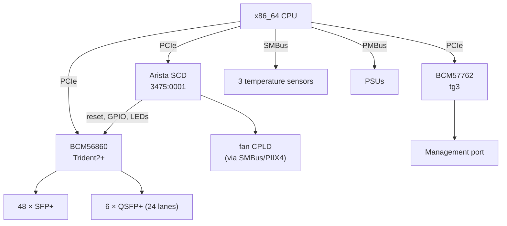

# Arista 7050SX2-72Q — hardware reference

How the box is built and how NOSaic will drive it. The investigation that
produced these facts lives in a private reverse-engineering repository; what is
here is what somebody changing NOSaic's datapath or debugging a port needs.

> **Nothing below has been exercised by NOSaic.** It is written from work done
> on this switch under EOS and from its own flash. Treat it as a map, not as a
> record of something that booted.

## At a glance

| | |
|---|---|
| ASIC | Broadcom BCM56860 (Trident2+), PCI `14e4:b860` |
| CPU / arch | x86_64 |
| Front panel | 48 × SFP+ (10G), 6 × QSFP+ (40G) — 72 × 10G, 24 QSFP lanes |
| Management | BCM57762, PCI `14e4:1682`, `tg3` |
| Board controller | Arista SCD, PCI `3475:0001` at `05:00.0` |
| Bootloader | Aboot; unsigned SWIs, `boot0` is a shell script |
| Console | ttyS0 @ 9600 |
| Board data | `prefdl`, SID `PortolaSPlus`, HwEpoch 1 |

## Block diagram



The SCD is the piece with no mainline equivalent. It is a PCI-enumerated board
controller, and ASIC reset, GPIO and LEDs go through it — so it has to be
brought up before the ASIC answers.

## Boot chain


Two things make this work without touching Aboot. The SWI carries `BLESSED=1`,
which is what lets Aboot boot an image with no signature, and
`SWI_MAX_HWEPOCH=1`, which this board's epoch does not exceed. Every member of
the archive is **Stored**, not deflated, with `version` first — matching the
vendor's own SWIs, from which this was read.

A/B slot selection is not Aboot's problem: NOSaic's initramfs reads the pointer
from its own boot partition, exactly as it does under GRUB or U-Boot.

## Port map

**The rule differs between cage types, and this is the trap.**

- For the **48 SFP+** ports, the SDK's physical port index *is* the RX lane.
- For the **24 QSFP lanes** it is not — there it follows the cage's subport.

Code that assumes one rule for both mis-maps two thirds of the QSFP capacity.
The symptom is a dead port, not an obviously wrong index, so it reads as a
hardware or optics fault and gets debugged in the wrong place. The board's own
`prefdl`/FDL board description carries the per-port lane map; derive from it
rather than by hand.

## Register and memory regions

The SCD is mapped from its PCI BAR and exposes board control — ASIC reset,
GPIO, LED state. The ASIC is reached over S-Channel through the CMIC once it is
out of reset and the PCI device has been rescanned.

Specific offsets and the register database belong to the reverse-engineering
repository and to Broadcom's SDK respectively. NOSaic references the SDK by
`file:line` and copies none of it: a register table transcribed from a vendor
header is that vendor's, and an image containing it could not be published.

## Datapath

`nosd-td2p` will drive the chip through the OpenBCM SDK — `sdk-6.5.24` carries
BCM56860 (`src/soc/mcm/bcm56860_a0.c`) with a full register and memory
database. The licence expressly permits distributing the source and derivative
works, so the resulting image is shippable. See the build page for the notice
obligation that comes with it.

**No Broadcom kernel modules.** The SDK ships a BDE as a pair of kernel modules
which target Linux 5.10 and older; NOSaic runs 6.12, and the gap is not
cosmetic — the BDE uses `ioremap_nocache`, removed in 5.6, and other interfaces
gone since. Patching it would mean owning that patch set forever, on hardware
whose vendor has moved on.

It is also unnecessary, and EOS demonstrates why: on this box EOS has no
arbitrating driver at all. Ten of its agents hold live mappings of the ASIC's
PCI BAR simultaneously, reaching the chip straight from userspace. The BDE's
job is small enough to do the same way:

| What the SDK needs | Where it comes from |
|---|---|
| Register access | `mmap` of the ASIC's BAR0 |
| PCI configuration | `/sys/bus/pci/devices/.../config` |
| DMA memory | a physically contiguous region, mapped through `/dev/mem` |
| Interrupts | none — the SDK polls when nothing is connected |

That is a `soc_cm_device_vectors_t` handed to `soc_cm_device_init()`, with
**everything above it the unmodified SDK**. The chip initialisation this board
needs — `_soc_trident2_mmu_init`, `soc_td2_lls_init` — is then Broadcom's own
code running, rather than a sequence reproduced by hand.

**This constrains the kernel command line.** The DMA pool must be physically
contiguous and its physical address known, which a pagemap lookup cannot
provide for a 32 MB pool. The region is reserved at boot instead:

```
memmap=64M$0x100000000
```

The `$` marks it reserved so the kernel never touches it, and physical
addresses become base plus offset. Whatever sets the kernel command line for
this board — `boot0` inside the SWI — has to carry that, and an image that
forgets it will initialise the chip and then fail at the first DMA.

It implements `switch-api`; it does not get to change it. Where the chip cannot
do what the contract describes, it says so through the capability model.

## Platform HAL

What is known to work, and what is not:

| | |
|---|---|
| Temperature | Three sensors over SMBus — read correctly, matching EOS |
| PSU presence | Works |
| PSU status | Works over PMBus, and identifies a failed supply |
| Fans | **Reachable only with `CONFIG_I2C_PIIX4`**, and readings are not trustworthy |

**Do not drive the fans.** There is no reliable fan reading on this board, so a
control loop built on it would be a control loop built on noise — on hardware
whose thermal failure mode is silent.

## Board data, and the MAC

The board keeps its identity in a `prefdl` structure on an i2c SEEPROM: the
SID, the serial, the ASIC core voltage, and the MAC base. Aboot reads it with
`readprefdl`, whose usage names the location plainly:

```
Usage: readprefdl [-a i2cAddr -b i2cBusNum] [-f inputFileName] [-do]
```

**Nothing in NOSaic reads it yet, and three things need it.**

`tg3` is the visible one. Arista does not keep the management MAC in the NIC,
so a stock driver finds nothing and aborts the probe, leaving the switch with
no management interface at all. NOSaic currently patches tg3 to fall back to a
random address so the device exists, and the board states its real MAC in
`config/network.conf` for the network service to apply. That works and is
honest about being a stopgap: a configuration file asserting hardware identity
is a configuration file that will be wrong on the next switch.

The other two are not optional for M6. `Trident0CoreVdd` is the ASIC's core
voltage and comes from board data; the chip cannot be brought up correctly
without it. And the platform HAL's identity -- model, serial, revision --
belongs to the same structure.

So the real work is a `prefdl` reader: find the bus and address, parse the
structure, and publish it early enough that the network configuration and the
datapath can both use it. Searching for it from Aboot did not find it at the
obvious SEEPROM addresses on buses 0 through 3 -- 0 and 1 answered with
"data format unsupported", 2 and 3 said nothing -- so the location needs
establishing properly rather than guessing, which on an SMBus carrying PSU
controllers and thermal sensors is worth doing carefully.

## The SCD, and how the ASIC gets onto the bus

The System Control Device is an FPGA at `0000:05:00.0` (`3475:0001`) that owns
everything on this board that is not forwarding: reset lines, GPIO, LEDs, the
watchdog, and the SMBus reaching the fan controller and the transceivers.

**It holds the Trident2+ in reset from power-on.** On a freshly booted NOSaic
there is no `0000:01:00.0` on the PCI bus at all — not a chip that fails to
respond, but no device. That is the expected state, and it is why the datapath
is gated on SCD bring-up rather than on the ASIC.

NOSaic drives it from `internal/platformhal/scd`, reached as
`nosaic platform`.

### Where these numbers come from

Arista publishes `sonic-platform-modules-arista` under GPL-2.0, written by the
authors of the EOS driver for this same FPGA. **The register offsets are read
from that tree** — `arista/drivers/scd/watchdog.py`,
`arista/components/denali/linecard.py` and its siblings — with credit due to
those drivers. No code was copied; only register maps were read. That makes
this a documentation result rather than a reverse-engineering one, which is
worth stating because it is much stronger evidence.

**The per-board bit assignment is not from that tree**, because this board is
not in it: `aristanetworks/sonic` returns nothing for `7050SX2`, `Portola` or
`72Q`. It is a 2017-era EOS-only box. Those values were established by reading
our own hardware, and are recorded below with how they were established.

### Register layout

Each reset block is three ports onto the same state, on a 0x10 stride:

| Offset | Access | Meaning |
|---|---|---|
| `addr + 0x00` | read / write-1-to-**set** | current state; writing a 1 **asserts** that reset |
| `addr + 0x10` | write-1-to-**clear** | writing a 1 **releases** that reset |
| `addr + 0x20` | read | status |

A bit reading **1 means that reset is asserted**. The switch-chip reset block
is at `0x4000` on every Arista platform in the GPL tree, from Trident2 to
Tomahawk4; only the bits vary.

Note that SCD registers are 4 bytes wide but the address decode ignores bits
`[3:2]`, so each register aliases across its 16-byte slot — `0x3000`, `0x3004`,
`0x3008` and `0x300c` all read identically.

### The reset bits: 0 and 1, not 2

Other platforms in the GPL tree put the PCIe reset on **bit 2**. Taking that
number here would be silently fatal, and it is worth spelling out why, because
the failure is invisible:

> Bit 2 is unimplemented on this board, and unimplemented bits read as 1.
> Clearing it writes to nothing. The chip never enumerates, `ResetState`
> reports it held in reset for ever, and the code that wrote the bit reports
> success.

What is attested is a live read of `0x4000` with the ASIC demonstrably running:

```
BAR0+0x004000: fffffffc
```

Exactly bits 0 and 1 are cleared. With the chip running, exactly two resets are
released — the core/PCIe pair every other platform declares.

⚠️ **Which of bit 0 and bit 1 is core and which is PCIe is not established.**
The majority convention (core = 0, pcie = 1) is what NOSaic uses. This is safe
for releasing the chip, because both end up cleared and only the 500 ms between
them is ordered. It would matter for asserting one reset selectively, which
nothing does yet.

### The release sequence

From Arista's `SwitchChip._resetOut()`. The ordering and the delays are the
hardware's contract, which is why `ReleaseSwitchChip` is one call rather than a
sequence the caller assembles:

1. clear the core reset bit
2. sleep 500 ms
3. clear the PCIe reset bit
4. wait ~1 s, then `echo 1 > /sys/bus/pci/rescan` — the kernel enumerated while
   the device was still in reset and found nothing, so it must be told
5. poll for the ASIC's sysfs node, then yield 2 s before touching it

### The watchdog — and the trap in it

`0x0120`, the same register the 7150 uses. Bit 31 enables; bits `[30:29]` are
the action, and **2 means power cycle** rather than a warm reset. That is what
makes it a real recovery path: a warm reset leaves a wedged chip wedged, where
a power cycle brings the board back through Aboot.

**It is not armed when NOSaic starts.** Aboot punches it during boot and leaves
it disarmed on handover, so a custom NOS begins with no recovery net at all.
Assuming otherwise is how a hung image became a trip to the PDU.

⚠️ **The timeout is the low 16 bits, in units of 10 ms** — which is where
Arista's GPL driver puts it. An earlier version of this page said it lived in
bits `[28:16]` at 100 ms, and NOSaic shipped a driver that believed it. That
was wrong, and the way it was wrong is worth keeping.

The original experiment armed the watchdog by setting **only the enable bit**
on the value Aboot leaves behind. Both fields kept their existing values, so
the 40–50 s it fired in was consistent with either being the timeout — bits
`[28:16]` = 500 at 100 ms is 50 s, and the low 16 bits = 6000 at 10 ms is 60 s.
One experiment, two models, no way to tell them apart. The conclusion was
recorded as settled anyway.

Varying the fields independently settles it:

| bits `[28:16]` | low 16 bits | fired after |
|---|---|---|
| 0 | 6000 | ~60 s |
| 0 | 12000 | ~120 s |
| 3000 | 6000 | ~60 s |
| 8000 | 6000 | ~60 s |

The high field contributes nothing, and the time is linear in the low one.

So arm with `(1<<31) | (2<<29) | centiseconds`. Writing the high field instead
leaves the real timeout at Aboot's leftover: the watchdog reports the value it
was asked for, reads it back, and then fires on somebody else's schedule. It
did exactly that here, twice, in the middle of releasing the ASIC from reset —
a nominal 300 s and a nominal 800 s window that both expired in about a minute.

Bits `[28:16]` are preserved rather than cleared. Aboot leaves 500 there and
nothing here knows what it means; guessing at an unknown field on the device
that power-cycles the board is not worth the tidiness.

`internal/platformhal/scd` has a test pinning this, including the exact
`0x41f41770` Aboot leaves and the `0xc1f42ee0` a 120 s arm should produce.

```sh
nosaic platform watchdog arm 300000     # 5 minutes; 655350 is the maximum
nosaic platform status
nosaic platform release-asic
```

## Being on the bus is not the same as answering

After `release-asic` the chip enumerates — `14e4:b860`, BAR0 assigned at
`0xf4000000`, 256 KiB — and every MMIO read still returns `0xffffffff`.

That is not a chip fault. A device brought up by `echo 1 > /sys/bus/pci/rescan`
is enumerated and has its BARs assigned, but nothing calls `pci_enable_device`
on it: that happens when a driver binds, and no driver binds to the switch
chip. Its PCI `COMMAND` register therefore stays `0x0000` and it decodes
nothing.

The comparison that makes it obvious is on the same board:

| device | `COMMAND` | |
|---|---|---|
| switch chip `01:00.0` | `0x0000` | decodes nothing |
| management NIC `04:00.0` | `0x0406` | memory space, bus master, INTx disabled — `tg3` bound and enabled it |

So the release sequence ends by setting the memory-space bit and reading it
back. **Bus mastering is deliberately left off.** Nothing does DMA yet, and
giving a chip that has not been initialised the ability to write host memory is
not a default worth having; the datapath will set it when it needs it.

⚠️ The symptom is worth recognising because it is so misleading: an all-ones
BAR is exactly what a chip still held in reset looks like, and exactly what a
failed mapping looks like. `nosaic platform asic` calls it out by name rather
than printing `0xffffffff` as though it were data.

## Talking to the chip

```
nosaic platform asic
```

```
pci         0000:01:00.0
id          14e4:b860  revision 02
bar0        0xf4000000  256 KiB
dev_rev_id  0x0002b860  matches the BCM56860 at revision 02
```

`CMIC_DEV_REV_ID` at BAR0+`0x010224` is the chip's own identity: device
`0xb860` is the BCM56860 and revision `0x02`. It is read as a **named
register** rather than by widening a sweep — the response to needing one value
further out is to name that value, not to read more of a device whose registers
can have side effects. It is also a real check rather than a plausible-looking
number, because PCI configuration space reports the same identity from a
completely separate path on the same box.

Reads of the first 4 KiB of BAR0 are bounded to that window on purpose. Blind
MMIO sweeps have reset this board twice.

**This was done from a standalone Aboot boot, with EOS never having run.** That
matters more than it sounds: everything previously established about this ASIC
was learned after a `kexec` from EOS, which leaves the chip in a state a
standalone boot does not reproduce, and `kexec` is separately known to reset
the SerDes here. "It answered last time" was not evidence for the path NOSaic
takes. It is now.

## Quirks

- **Everything proven so far was proven after `kexec` from EOS**, and `kexec`
  resets the SerDes here. Booting standalone from Aboot leaves the chip in a
  different state, so prove standalone boot before the datapath work depends on
  it.
- **The SCD must be up before the ASIC answers.** Reset is released through it.
- **A rescanned device decodes nothing until its PCI COMMAND says so.** All-ones
  MMIO after a successful release is this, not a dead chip. See above.
- **The PCIe reset is bit 1 here, not bit 2.** Bit 2 is unimplemented and
  reads as 1, so using another platform's number releases nothing and says
  it worked. See above.
- **The watchdog is disarmed when NOSaic starts**, and its timeout is in bits
  `[28:16]`, not the low 16 bits the GPL driver uses.
- **Fan readings are garbage.** See above.

## Reverse engineering

A private repository, outside this tree and not published. It holds the traces,
the eliminated hypotheses and the vendor-derived material that cannot ship. This
page is the part that is NOSaic's own.
