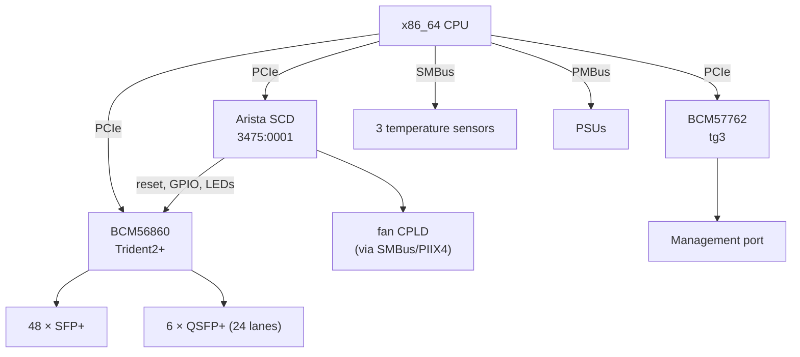

# Arista 7050SX2-72Q — hardware reference

How the box is built and how NOSaic drives it. The investigation that produced
these facts lives in a private reverse-engineering repository; what is here is
what somebody changing NOSaic's datapath or debugging a port needs.

This is the register-level reference. For the shape of the whole system — what
each piece does and how a packet actually travels — start with
**[architecture.md](architecture.md)**.

> Most of what follows has now been exercised by NOSaic on the switch. Where a
> section describes something still unproven it says so; the summary of which
> is which is in
> [architecture.md](architecture.md#8-what-is-proven-and-what-is-not).

## At a glance

| | |
|---|---|
| ASIC | Broadcom BCM56860 (Trident2+), PCI `14e4:b860` |
| CPU / arch | x86_64 |
| Front panel | 48 × SFP+ (10G), 6 × QSFP+ (40G) — 72 × 10G, 24 QSFP lanes |
| Management | BCM57762, PCI `14e4:1682`, `tg3` |
| Board controller | Arista SCD, PCI `3475:0001` at `05:00.0` |
| Bootloader | Aboot; unsigned SWIs, `boot0` is a shell script |
| Console | ttyS0 @ 9600 |
| Board data | `prefdl`, SID `PortolaSPlus`, HwEpoch 1 |

## Block diagram



The SCD is the piece with no mainline equivalent. It is a PCI-enumerated board
controller, and ASIC reset, GPIO and LEDs go through it — so it has to be
brought up before the ASIC answers.

## Boot chain


Two things make this work without touching Aboot. The SWI carries `BLESSED=1`,
which is what lets Aboot boot an image with no signature, and
`SWI_MAX_HWEPOCH=1`, which this board's epoch does not exceed. Every member of
the archive is **Stored**, not deflated, with `version` first — matching the
vendor's own SWIs, from which this was read.

A/B slot selection is not Aboot's problem: NOSaic's initramfs reads the pointer
from its own boot partition, exactly as it does under GRUB or U-Boot.

## Port map

**The rule differs between cage types, and this is the trap.**

- For the **48 SFP+** ports, the SDK's physical port index *is* the RX lane.
- For the **24 QSFP lanes** it is not — there it follows the cage's subport.

Code that assumes one rule for both mis-maps two thirds of the QSFP capacity.
The symptom is a dead port, not an obviously wrong index, so it reads as a
hardware or optics fault and gets debugged in the wrong place. The board's own
`prefdl`/FDL board description carries the per-port lane map; derive from it
rather than by hand.

## Register and memory regions

The SCD is mapped from its PCI BAR and exposes board control — ASIC reset,
GPIO, LED state. The ASIC is reached over S-Channel through the CMIC once it is
out of reset and the PCI device has been rescanned.

Specific offsets and the register database belong to the reverse-engineering
repository and to Broadcom's SDK respectively. NOSaic references the SDK by
`file:line` and copies none of it: a register table transcribed from a vendor
header is that vendor's, and an image containing it could not be published.

## Datapath

`nosd-td2p` drives the chip through the OpenBCM SDK — `sdk-6.5.24` carries
BCM56860 (`src/soc/mcm/bcm56860_a0.c`) with a full register and memory
database. The licence expressly permits distributing the source and derivative
works, so the resulting image is shippable. See the build page for the notice
obligation that comes with it.

**No Broadcom kernel modules.** The SDK ships a BDE as a pair of kernel modules
which target Linux 5.10 and older; NOSaic runs 6.12, and the gap is not
cosmetic — the BDE uses `ioremap_nocache`, removed in 5.6, and other interfaces
gone since. Patching it would mean owning that patch set forever, on hardware
whose vendor has moved on.

It is also unnecessary, and EOS demonstrates why: on this box EOS has no
arbitrating driver at all. Ten of its agents hold live mappings of the ASIC's
PCI BAR simultaneously, reaching the chip straight from userspace. The BDE's
job is small enough to do the same way:

| What the SDK needs | Where it comes from |
|---|---|
| Register access | `mmap` of the ASIC's BAR0 |
| PCI configuration | `/sys/bus/pci/devices/.../config` |
| DMA memory | a physically contiguous region, mapped through `/dev/mem` |
| Interrupts | none — the SDK polls when nothing is connected |

That is a `soc_cm_device_vectors_t` handed to `soc_cm_device_init()`, with
**everything above it the unmodified SDK**. The chip initialisation this board
needs — `_soc_trident2_mmu_init`, `soc_td2_lls_init` — is then Broadcom's own
code running, rather than a sequence reproduced by hand.

**This constrains the kernel command line.** The DMA pool must be physically
contiguous and its physical address known, which a pagemap lookup cannot
provide for a 32 MB pool. The region is reserved at boot instead:

```
memmap=64M$0xd0000000
```

This is the value in `board.yml`, which is the one that matters — an earlier
draft of this page said `0x100000000` and the two disagreeing is exactly the
kind of thing that costs an afternoon.

The `$` marks it reserved so the kernel never touches it, and physical
addresses become base plus offset. Whatever sets the kernel command line for
this board — `boot0` inside the SWI — has to carry that, and an image that
forgets it will initialise the chip and then fail at the first DMA.

It implements `switch-api`; it does not get to change it. Where the chip cannot
do what the contract describes, it says so through the capability model.

## Platform HAL

What is known to work, and what is not:

| | |
|---|---|
| Temperature | Three sensors over SMBus — read correctly, matching EOS |
| PSU presence | Works |
| PSU status | Works over PMBus, and identifies a failed supply |
| Fans | **Reachable only with `CONFIG_I2C_PIIX4`**, and readings are not trustworthy |

**Do not drive the fans.** There is no reliable fan reading on this board, so a
control loop built on it would be a control loop built on noise — on hardware
whose thermal failure mode is silent.

## Board data, and the MAC

The board keeps its identity in a `prefdl` structure on an i2c SEEPROM: the
SID, the serial, the ASIC core voltage, and the MAC base. Aboot reads it with
`readprefdl`, whose usage names the location plainly:

```
Usage: readprefdl [-a i2cAddr -b i2cBusNum] [-f inputFileName] [-do]
```

**Nothing in NOSaic reads it yet, and three things need it.**

`tg3` is the visible one. Arista does not keep the management MAC in the NIC,
so a stock driver finds nothing and aborts the probe, leaving the switch with
no management interface at all. NOSaic currently patches tg3 to fall back to a
random address so the device exists, and the board states its real MAC in
`config/network.conf` for the network service to apply. That works and is
honest about being a stopgap: a configuration file asserting hardware identity
is a configuration file that will be wrong on the next switch.

The other two are not optional for M6. `Trident0CoreVdd` is the ASIC's core
voltage and comes from board data; the chip cannot be brought up correctly
without it. And the platform HAL's identity -- model, serial, revision --
belongs to the same structure.

So the real work is a `prefdl` reader: find the bus and address, parse the
structure, and publish it early enough that the network configuration and the
datapath can both use it. Searching for it from Aboot did not find it at the
obvious SEEPROM addresses on buses 0 through 3 -- 0 and 1 answered with
"data format unsupported", 2 and 3 said nothing -- so the location needs
establishing properly rather than guessing, which on an SMBus carrying PSU
controllers and thermal sensors is worth doing carefully.

## The SCD, and how the ASIC gets onto the bus

The System Control Device is an FPGA at `0000:05:00.0` (`3475:0001`) that owns
everything on this board that is not forwarding: reset lines, GPIO, LEDs, the
watchdog, and the SMBus reaching the fan controller and the transceivers.

**It holds the Trident2+ in reset from power-on.** On a freshly booted NOSaic
there is no `0000:01:00.0` on the PCI bus at all — not a chip that fails to
respond, but no device. That is the expected state, and it is why the datapath
is gated on SCD bring-up rather than on the ASIC.

NOSaic drives it from `internal/platformhal/scd`, reached as
`nosaic platform`.

### Where these numbers come from

Arista publishes `sonic-platform-modules-arista` under GPL-2.0, written by the
authors of the EOS driver for this same FPGA. **The register offsets are read
from that tree** — `arista/drivers/scd/watchdog.py`,
`arista/components/denali/linecard.py` and its siblings — with credit due to
those drivers. No code was copied; only register maps were read. That makes
this a documentation result rather than a reverse-engineering one, which is
worth stating because it is much stronger evidence.

**The per-board bit assignment is not from that tree**, because this board is
not in it: `aristanetworks/sonic` returns nothing for `7050SX2`, `Portola` or
`72Q`. It is a 2017-era EOS-only box. Those values were established by reading
our own hardware, and are recorded below with how they were established.

### Register layout

Each reset block is three ports onto the same state, on a 0x10 stride:

| Offset | Access | Meaning |
|---|---|---|
| `addr + 0x00` | read / write-1-to-**set** | current state; writing a 1 **asserts** that reset |
| `addr + 0x10` | write-1-to-**clear** | writing a 1 **releases** that reset |
| `addr + 0x20` | read | status |

A bit reading **1 means that reset is asserted**. The switch-chip reset block
is at `0x4000` on every Arista platform in the GPL tree, from Trident2 to
Tomahawk4; only the bits vary.

Note that SCD registers are 4 bytes wide but the address decode ignores bits
`[3:2]`, so each register aliases across its 16-byte slot — `0x3000`, `0x3004`,
`0x3008` and `0x300c` all read identically.

### The reset bits: 0 and 1, not 2

Other platforms in the GPL tree put the PCIe reset on **bit 2**. Taking that
number here would be silently fatal, and it is worth spelling out why, because
the failure is invisible:

> Bit 2 is unimplemented on this board, and unimplemented bits read as 1.
> Clearing it writes to nothing. The chip never enumerates, `ResetState`
> reports it held in reset for ever, and the code that wrote the bit reports
> success.

What is attested is a live read of `0x4000` with the ASIC demonstrably running:

```
BAR0+0x004000: fffffffc
```

Exactly bits 0 and 1 are cleared. With the chip running, exactly two resets are
released — the core/PCIe pair every other platform declares.

⚠️ **Which of bit 0 and bit 1 is core and which is PCIe is not established.**
The majority convention (core = 0, pcie = 1) is what NOSaic uses. This is safe
for releasing the chip, because both end up cleared and only the 500 ms between
them is ordered. It would matter for asserting one reset selectively, which
nothing does yet.

### The release sequence

From Arista's `SwitchChip._resetOut()`. The ordering and the delays are the
hardware's contract, which is why `ReleaseSwitchChip` is one call rather than a
sequence the caller assembles:

1. clear the core reset bit
2. sleep 500 ms
3. clear the PCIe reset bit
4. wait ~1 s, then `echo 1 > /sys/bus/pci/rescan` — the kernel enumerated while
   the device was still in reset and found nothing, so it must be told
5. poll for the ASIC's sysfs node, then yield 2 s before touching it

### The watchdog — and the trap in it

`0x0120`, the same register the 7150 uses. Bit 31 enables; bits `[30:29]` are
the action, and **2 means power cycle** rather than a warm reset. That is what
makes it a real recovery path: a warm reset leaves a wedged chip wedged, where
a power cycle brings the board back through Aboot.

**It is not armed when NOSaic starts.** Aboot punches it during boot and leaves
it disarmed on handover, so a custom NOS begins with no recovery net at all.
Assuming otherwise is how a hung image became a trip to the PDU.

⚠️ **The timeout is the low 16 bits, in units of 10 ms** — which is where
Arista's GPL driver puts it. An earlier version of this page said it lived in
bits `[28:16]` at 100 ms, and NOSaic shipped a driver that believed it. That
was wrong, and the way it was wrong is worth keeping.

The original experiment armed the watchdog by setting **only the enable bit**
on the value Aboot leaves behind. Both fields kept their existing values, so
the 40–50 s it fired in was consistent with either being the timeout — bits
`[28:16]` = 500 at 100 ms is 50 s, and the low 16 bits = 6000 at 10 ms is 60 s.
One experiment, two models, no way to tell them apart. The conclusion was
recorded as settled anyway.

Varying the fields independently settles it:

| bits `[28:16]` | low 16 bits | fired after |
|---|---|---|
| 0 | 6000 | ~60 s |
| 0 | 12000 | ~120 s |
| 3000 | 6000 | ~60 s |
| 8000 | 6000 | ~60 s |

The high field contributes nothing, and the time is linear in the low one.

So arm with `(1<<31) | (2<<29) | centiseconds`. Writing the high field instead
leaves the real timeout at Aboot's leftover: the watchdog reports the value it
was asked for, reads it back, and then fires on somebody else's schedule. It
did exactly that here, twice, in the middle of releasing the ASIC from reset —
a nominal 300 s and a nominal 800 s window that both expired in about a minute.

Bits `[28:16]` are preserved rather than cleared. Aboot leaves 500 there and
nothing here knows what it means; guessing at an unknown field on the device
that power-cycles the board is not worth the tidiness.

`internal/platformhal/scd` has a test pinning this, including the exact
`0x41f41770` Aboot leaves and the `0xc1f42ee0` a 120 s arm should produce.

```sh
nosaic platform watchdog arm 300000     # 5 minutes; 655350 is the maximum
nosaic platform status
nosaic platform release-asic
```

## Being on the bus is not the same as answering

After `release-asic` the chip enumerates — `14e4:b860`, BAR0 assigned at
`0xf4000000`, 256 KiB — and every MMIO read still returns `0xffffffff`.

That is not a chip fault. A device brought up by `echo 1 > /sys/bus/pci/rescan`
is enumerated and has its BARs assigned, but nothing calls `pci_enable_device`
on it: that happens when a driver binds, and no driver binds to the switch
chip. Its PCI `COMMAND` register therefore stays `0x0000` and it decodes
nothing.

The comparison that makes it obvious is on the same board:

| device | `COMMAND` | |
|---|---|---|
| switch chip `01:00.0` | `0x0000` | decodes nothing |
| management NIC `04:00.0` | `0x0406` | memory space, bus master, INTx disabled — `tg3` bound and enabled it |

So the release sequence ends by setting the memory-space bit and reading it
back. **Bus mastering is deliberately left off.** Nothing does DMA yet, and
giving a chip that has not been initialised the ability to write host memory is
not a default worth having; the datapath will set it when it needs it.

⚠️ The symptom is worth recognising because it is so misleading: an all-ones
BAR is exactly what a chip still held in reset looks like, and exactly what a
failed mapping looks like. `nosaic platform asic` calls it out by name rather
than printing `0xffffffff` as though it were data.

## Talking to the chip

```
nosaic platform asic
```

```
pci         0000:01:00.0
id          14e4:b860  revision 02
bar0        0xf4000000  256 KiB
dev_rev_id  0x0002b860  matches the BCM56860 at revision 02
```

`CMIC_DEV_REV_ID` at BAR0+`0x010224` is the chip's own identity: device
`0xb860` is the BCM56860 and revision `0x02`. It is read as a **named
register** rather than by widening a sweep — the response to needing one value
further out is to name that value, not to read more of a device whose registers
can have side effects. It is also a real check rather than a plausible-looking
number, because PCI configuration space reports the same identity from a
completely separate path on the same box.

Reads of the first 4 KiB of BAR0 are bounded to that window on purpose. Blind
MMIO sweeps have reset this board twice.

**This was done from a standalone Aboot boot, with EOS never having run.** That
matters more than it sounds: everything previously established about this ASIC
was learned after a `kexec` from EOS, which leaves the chip in a state a
standalone boot does not reproduce, and `kexec` is separately known to reset
the SerDes here. "It answered last time" was not evidence for the path NOSaic
takes. It is now.

## S-Channel: the engine runs, the blocks do not answer yet

MMIO on the ASIC's BAR reaches the CMIC, the chip's host interface. Everything
behind it — registers inside the forwarding blocks, table memories — goes
through S-Channel: write a command word and an address into the message
registers, set `MSG_START`, poll for `MSG_DONE`, read the response back out of
the same registers.

```
0x031000  CMIC_CMC0_SCHAN_CTRL
0x031004  CMIC_CMC0_SCHAN_ACK_DATA_BEAT_COUNT
0x031008  CMIC_CMC0_SCHAN_ERR
0x03100c  CMIC_CMC0_SCHAN_MESSAGE0 … MESSAGE22
```

CMC1 and CMC2 mirror this at `0x032000` and `0x033000`. CMC0 is the active one
here — a live read finds CMC0 populated and CMC1 entirely zero, which is what a
single-unit system looks like.

`SCHAN_CTRL` bits: `MSG_START` 0, `MSG_DONE` 1, `ABORT` 2, `SER_CHECK_FAIL` 20,
`NACK` 21, `TIMEOUT` 22, `SCHAN_ERROR` 23.

### What NOSaic has established

```
nosaic platform schan selftest
```

Reading `TOP_DEV_REV_ID` (block 57, `0x02030000`), whose correct answer
`0x0002b860` is already known from two other paths on this board:

- **The message registers are writable**, and read back exactly what was
  written. This is checked before every transaction, because without it
  `MSG_DONE`-with-`TIMEOUT` is ambiguous in a way that matters: a BAR write
  that never lands looks identical to a block that does not answer, and the two
  need completely different work.
- **The engine runs.** It accepts `MSG_START` and raises `MSG_DONE` after
  around 14 polls, with `SCHAN_CTRL = 0x00400002` — done, plus `TIMEOUT`.
- **No block answers**, under either header variant and every access value.

That last point is not a failure of S-Channel. The engine is the CPU's side of
the interface and comes up with the CMIC; the blocks behind it are held in
reset until chip initialisation releases them. **Chip initialisation is the next
work, not S-Channel.**

### The header, and the ambiguity that is now settled by measurement

```
[31:26] opcode   [25:20] block   [16:14] access   [13:7] length
```

Confirmed against a command word captured from the vendor's driver:
`OPC=7 DPORT=1 ACC=3 DLEN=4` encodes to `0x1c10c200`.

The chip supports a second header format selected by a runtime feature flag,
which places the block field in **7** bits at `[25:19]` instead of 6 at
`[25:20]`. The reverse-engineering work could not settle which is active — the
flag is runtime state, and a captured word decodes plausibly under both — so
NOSaic tries both against a read whose answer is known. Neither reaches a block
in the current chip state, so **the ambiguity remains open**; what has been
established is that it is not the reason nothing answers.

### Reads only

This code issues `READ_REG_CMD` and `READ_MEM_CMD` and refuses every other
opcode, including at the API rather than by convention. A bad read of a
forwarding ASIC is recoverable; a bad write is not. It also refuses to start
when `MSG_START` is already set — on a board where the vendor OS may have been
driving this chip minutes earlier, stomping an in-flight transaction is not
hypothetical.

## Chip initialisation: the SDK does it

```
doas nosd-td2p --attach 0000:01:00.0 /etc/nosaic/asic.conf
config     55 properties from /etc/nosaic/asic.conf
SOC unit 0 attached to PCI device BCM56860_A1
SDK unit   0
chip init complete; the SDK has the device.
```

`soc_attach` **is** chip initialisation. Reaching this means the Broadcom SDK
brought the Trident2+ up through NOSaic's userspace BDE, from a standalone
Aboot boot, with EOS never having run.

Chip init is deliberately not NOSaic's code. The Trident2 MMU and LLS sequences
are exactly what hand-reproduction repeatedly failed to match on this silicon,
and the design decision is to use the vendor SDK where the licence permits. The
BDE exists so that decision is available.

### Three things it needed, none of them obvious

**A port map that respects the quad budget.** The chip is four quads of 32
physical ports, each with a line-rate budget of its quarter of device bandwidth
— 240 Gb here. Numbering the 72 lanes 1..72 puts 320 Gb in each of the first
two quads and nothing in the other two:

```
PGW_CL0 and PGW_CL1 total line rate bandwidth (320 Gb) exceeds 240 Gb
```

Ports group in fours — 4 lanes per XLP, 4 XLPs per PGW, 2 PGWs per quad — and
every XLP this board uses carries 40 Gb whether it is four 10G SFP+ lanes or
one 40G QSFP cage. So the 18 XLPs needed are dealt round-robin across the four
quads, 5/5/4/4, giving 200/200/160/160 Gb. See `config/asic.conf`.

**Polled interrupts.** NOSaic's BDE has no interrupt to connect: it reaches the
chip by mapping the PCI BAR from userspace, and no kernel driver is bound to
route a vector to it. Without `polled_irq_mode=1` the SDK takes the IRQ path
and stops at `soc_attach: could not connect interrupt line`. The SDK's own
poller is the supported alternative, so this selects a path it offers rather
than working around it.

**Matching feature flags.** Several SDK flags change struct layouts, and
`INCLUDE_RCPU` adds a pointer to `soc_cm_device_vectors_t` immediately after
`bus_type`. The libraries are built with it; code that is not gets every
function pointer one slot off. It compiles, links and runs, and fails as
`SOC_E_PARAM` from a macro that returns without logging anything — with every
vector correctly set from the caller's side.

⚠️ **Wire BSL to stderr before anything else.** Every failure inside the SDK
reports through its log and then returns a small negative number. With no sink
you get the number and none of the sentence: `-4` instead of
`Port config error !!`.

### The mapping must outlive the call

`soc_attach` starts threads of the SDK's own, and in polled mode `bcmPOLL`
reads the BAR continuously through our vectors. Tearing the BDE down after
attaching unmapped it underneath them, and `bcmPOLL` segfaulted on its next
register read while the attach was busy reporting success:

```
bcmPOLL[458]: segfault at 7fbfd3f6a400 ip 0000000000405974 ... in nosd-td2p
```

The device handed to the SDK is therefore static, not a local: the cookie
passed to `soc_cm_device_create` comes back in every vector call for the life
of the device, from threads that outlive the function that created it.

`--attach` holds for ten seconds before exiting, which is what makes this
visible at all — a run that returns immediately cannot tell a healthy poller
from one that is about to die.

## The port map, and why it cannot be guessed

The SDK cannot bring up a port without knowing which logical port is wired to
which physical SerDes lane. Read off this board with EOS's own
`show platform trident system detail`:

| front panel | logical | physical lanes |
|---|---|---|
| Ethernet1..20 | 1..20 | 13..32 |
| Ethernet21..48 | 21..48 | 41..68 |
| Ethernet49/1..4 | 49..52 | 73..76 |
| Ethernet50/1..4 | 53..56 | **69..72** |
| Ethernet54/1..4 | 69..72 | 97..100 |

Ethernet50 sits *below* Ethernet49. The cages are not in physical order and
nothing about the layout follows from the front panel.

⚠️ **A wrong port map is not rejected — it is silently inert.** A sequential
map satisfies every bandwidth rule the chip enforces, initialises completely,
and brings up nothing. That is how this port reached "full chip initialisation
works" while being wrong about every port on the board.

### The QSFP cages are either one 40G port or four 10G ports

That choice changes the map, and EOS names the cage accordingly:

| cage configured as | EOS calls it | map entry |
|---|---|---|
| 4 × 10G breakout | `Ethernet49/1` … `/4` | four ports at `:10` |
| 1 × 40G | `Ethernet49` | one port at `:40` |

So `tools/mkportmap.sh` takes the speed from how the cage is configured rather
than from the cage type: a slashed name is one 10G lane of a breakout, and an
unslashed name above the SFP+ range is a whole 40G cage. Mapping a 40G cage as
four 10G lanes spends four logical ports on hardware that has one, and the chip
accepts it without complaint.

**Regenerate the map after changing any breakout**, because the logical
numbering moves with it.

### It is generated, not shipped

The numbers are the vendor's, read from the machine that already has them, so
NOSaic ships the generator and not its output:

```sh
tools/mkportmap.sh <switch-ip> > portmap.conf
tools/mkportmap.sh --stdin < captured.txt > portmap.conf   # e.g. from a console
nosd-td2p --init 0000:01:00.0 asic.conf portmap.conf
```

Later files override earlier ones, so the generated map layers over the board's
shipped defaults rather than being pasted into them.

This is the arrangement EdgeNOS uses on this board and the approach is taken
from its `tools/mkconfigbcm.sh`; its `PROVENANCE.md` sets out which parts of a
platform may be published and why.

## What a port needs before it will link


An initialised chip is not a working port. The full initialisation runs, every
port answers the port API, linkscan is running and every port enables without
complaint — and with the two board facts below missing, **no port has link**.
That is not evidence that the port map is wrong, which is what it looks like.

Both are now supplied, by `config/polarity.conf` and `config/portmap.conf`
respectively, and the cabled ports link. Both files are generated per switch by
the scripts in [tools/](../tools/) and are deliberately not in this repository:
see [build.md](build.md#site-configuration-is-not-in-the-repository-but-it-is-in-the-build).

### The PCB swaps P/N pairs, per lane

This board has differential pairs swapped on the printed circuit board, lane by
lane, on both transmit and receive. The SerDes has to be told, through
`phy_xaui_tx_polarity_flip_<port>` and `phy_xaui_rx_polarity_flip_<port>`
properties, or the link comes up and carries nothing.

An inverted 64b/66b stream is uniquely deceptive, which is why this took a long
time to find:

| observed | why inversion explains it |
|---|---|
| block SYNC achieved, `HI_BER=0` | sync keys on the 2-bit header, and inverting `01` gives `10`, also valid |
| no frames decode, and no error counters either | every block descrambles to garbage, and garbage that never forms a frame is never counted as a bad one |
| PRBS never locks | inversion breaks PRBS outright |
| light arrives at −2.18 dBm, LOS clear | inversion is a data property, not an optical one |
| MAC and PHY loopbacks pass 100/100 | internal loopback is symmetric, so the inversion cancels |
| the vendor OS works on the same port and fibre | it applies the board's polarity from its own platform data |

A switch that looks healthy at every layer and moves no traffic is the failure
this produces.

### Neither the port map nor the polarity table can be copied

Both are facts about how this particular board is wired. Both exist in
EOS-derived form in the reverse-engineering repository, and both are marked
non-publishable there — so NOSaic has to derive them rather than copy them.

That is tractable, because **link is its own oracle**: a cage with a cable in
it either comes up or does not, and the answer is a fact the chip reports.
`nosd-td2p --init` surveys every port and prints those that have link, which is
the instrument for the derivation rather than a diagnostic afterthought.

What it needs to become a real measurement is knowing which cages have cables
in them, so that "no link" can be told apart from "nothing plugged in". Module
presence is readable independently of link, and that is the next piece.

## The 40G cages

Both QSFP+ cages carrying cables link at 40000 and pass traffic from a cold
boot. Getting there needed three things and a great deal that turned out not to
matter, and the second is worth as much as the first.

### The cage is switched off at the board controller

An optic that is present, seated and correct still emits nothing while the SCD
holds it in low power and reset. The transceiver control table is:

```
BAR0 + 0xa010, stride 0x10, 54 entries    48 SFP+ then 6 QSFP+
```

so the six QSFP cages are at `0xa310`, `0xa320`, `0xa330`, `0xa340`, `0xa350`
and `0xa360`. Three bits matter:

| bit | mask | meaning | applies to |
|-----|------|---------|-----------|
| 6 | `0x40` | `TX_DISABLE` | SFP+ and QSFP+ |
| 5 | `0x20` | low power | **QSFP+ only** |
| 7 | `0x80` | reset | **QSFP+ only** |

Clearing `TX_DISABLE` is enough for an SFP+ and is *not* enough for a QSFP+:
bits 5 and 7 have no SFP+ counterpart, and leaving them set is a laser that
never lights. `internal/platformhal/scd` clears all three for a QSFP cage and
only `TX_DISABLE` for an SFP+.

Two traps sit around this register:

- **It does not read back what you write.** Writing `0x01` reads back `0x08`.
  Verifying a write by reading it tells you nothing; the far end's carrier is
  the measurement.
- **It survives a warm reboot.** The SCD is a board controller and `reboot`
  does not reset it, so a manual `devmem` poke persists across an image change.
  That is how a fix was once declared proven by an image that did not contain
  it. To test an SCD change honestly, write the cage back to low power
  (`devmem 0xfc00a350 32 0x1A1`), confirm the far end goes `NO-CARRIER`, and
  only then reboot.

### `port_init_speed` is read by port NAME

The port map's `:40` is not sufficient on its own. A global `port_init_speed`
applies to every port including the 40G ones, and the per-port override is
keyed by the SDK's port *name*, not its number:

```
port_init_speed_xe52=40000      # correct — xe52 is the port's index in pbmp_xport_xe
port_init_speed_65=40000        # loaded, counted, never read
```

`xeN` is the port's index within `pbmp_xport_xe`, so it **moves with the port
count**. Under this board's 54-port map the six cages are `xe48`..`xe53`; under
a 72-port map every name above `xe47` means a different port. A polarity or
lane-map file generated against one map is silently wrong under the other.

### What was not the problem

Recorded because each was tried, and because a reader who finds these ports
down will reach for the same things:

| suspected | verdict |
|---|---|
| SerDes polarity | EOS's own values, and confirmed read by the property report |
| lane maps | likewise; and at 40GBASE-R4 the alignment markers deskew and reorder for you |
| clause 72/73/37 autoneg | removed entirely; the links come up without them |
| MMU bandwidth | the chip's own table shows 40 at physical 85 and 97 |
| STP state | already `FORWARD`; port enable already 1 |
| MAC loopback, frame max | loopback off, 1622 on 40G and 10G alike |
| a missing CPU-to-ASIC header | the 10G ports use the identical `bcm_tx` path |

### The counters lie, and the L2 table does not

The most expensive part of this was not the fault. It was that **`bcm_stat_get`
read zero on a 40G port that was receiving perfectly** — including
`snmpIfInNUcastPkts`, so it could not be explained away as "no unicast yet".
Zero is also what a genuinely dead port reads, so the diagnostic looked like it
was answering and was not.

What settled it in one line was the chip's L2 table:

```
l2:   80:a2:35:81:ca:e1 vlan 1054 port 69
```

That is the neighbour's MAC, learned by the ASIC, on the 40G port, in the right
VLAN. **A learned source address is proof the chip received and accepted a
frame there** — it does not depend on the counter subsystem, on the punt path,
or on anything reaching the CPU. `nosd-td2p` now dumps it alongside the port
counters for exactly that reason.

Two lessons, both cheap to apply next time:

- keep a **control** in every measurement. A 10G port carrying pings and a 40G
  port carrying nothing reported identical counters, and it was the control
  that proved the instrument wrong rather than the port.
- prefer a measurement that **cannot be faked by the thing you are testing**.
  L2 learning is a side effect of reception; a counter is a report about it.

## What EOS sets that we do not

EOS's live SDK configuration was dumped from this board and is the closest
thing to ground truth for how this silicon is meant to be driven. Twenty-seven
global properties, and the useful part is the gap.

**EOS polls nothing except MDIO.** It sets `miim_intr_enable=0` and not one
other `*_intr_enable`, no `polled_irq_mode`, and no
`pktdma_poll_mode_channel_bitmap` — so every one of those takes the default,
which is to use interrupts. Our configuration was the opposite for a reason
that has since gone away: with no interrupt path, each of those was added to
get past a specific bring-up failure.

### Not ours to copy

Five of EOS's properties **do not exist in OpenBCM 6.5.24**:

| property | EOS value |
|---|---|
| `force_core_pll` | 1 |
| `force_core_pll_freq` | 415 |
| `cut_through` | 1 |
| `ar_unconnected_pbmp` | 0x7e000000000000000000 |
| `port_init_cl72_hg` | 0x11 |

The `ar_` prefix gives it away: **EOS runs a modified SDK**. Setting these here
would load them, count them, report them as configuration and have no effect
whatever — the exact failure the unread-property report exists to catch. If
something later needs the core PLL pinned to 415 MHz, that is a register write
or an SDK patch, not a line in this file.

### Recorded, not adopted

These are real properties in our SDK that EOS sets and we do not. None is
adopted yet, because changing them alongside the interrupt work would make a
failure impossible to attribute. They are written down because they are the
vendor's answers for this board and several look like they matter.

| property | EOS | what it does |
|---|---|---|
| `l2xmsg_mode` | 1 | L2 learning through the hardware FIFO. The SDK default is `L2MODE_POLL` — a thread scanning the table (`include/soc/l2x.h:327`) |
| `l2_mem_entries` | 163840 | L2 table sizing |
| `l3_mem_entries` | 147456 | L3 table sizing |
| `bcm_num_cos` | 8 | CoS queues |
| `multicast_l2_range` | 24575 | |
| `multicast_l3_range` | 0 | |
| `max_vp_lags` | 0 | virtual-port LAGs, off |
| `ipv6_lpm_128b_enable` | 0 | with `num_ipv6_lpm_128b_entries=0` |
| `bcm_stat_jumbo` | 9236 | jumbo threshold for statistics |
| `module_64ports` | 1 | 64-port module mode; the default is 32 (`src/soc/esw/drv.c:1977`) |
| `ptp_bs_fref`, `ptp_ts_pll_fref` | 1, 1 | PTP clock references |
| `run_l2_sw_aging` | 0 | already the default |
| `higig2_hdr_mode` | 1 | read only on the Katana2 path in this SDK, so probably inert here |
| `xgxs_lcpll_xtal_refclk` | 1 | read only by the QSGMII PHY driver here, so probably inert |

`l2xmsg_mode` and `module_64ports` are the two most likely to change behaviour
on this board. The sizing properties are worth a look whenever a table turns
out to be smaller than expected.

### Adopted

Only the four DMA timeouts, and only because the failure being chased lives
inside a function that takes one:

```
dma_desc_timeout_usec=15000000      SDK default: 1 second
cdma_timeout_usec=15000000          include/soc/cmic.h:662-675
tdma_timeout_usec=15000000
tslam_timeout_usec=15000000
```

## How Aboot resolves `flash:`

Established from Aboot's own `/bin/initblockdev` on this switch, because it
decides whether the eMMC can be repartitioned without losing the boot path.

`flash:` is not "the FAT32 partition" and not "the first partition". It is
whatever is mounted at `/mnt/flash`, and the mount point is chosen per
partition in three tiers:

1. **By filesystem label.** A label starting `eos-` or `eos_` (case
   insensitive) mounts at `/mnt/<rest>`, lowercased — `EOS-TEST` becomes
   `/mnt/test`.
2. **By sysfs device path**, from `/etc/blockdev`:

   ```
   pci0000:00/0000:00:14.7/mmc_host/.*$             flash
   pci0000:00/0000:00:12.0/usb1/1-1/1-1.1/.*$       usb1
   pci0000:00/0000:00:12.0/usb1/1-1/1-1.4/.*$       usb2
   pci0000:00/0000:00:11.0/.*host./target.:0:0/.*$  drive
   ```

   The match is on the **controller**, not the partition — so every partition
   on the eMMC wants `/mnt/flash`.
3. A final default of `/mnt/flash`.

**On this switch it is tier 2.** `/dev/mmcblk0p1` carries no label at all, only
`UUID="559C-F7A5"`, and `/mnt/flash.conf` records it as matched by device path:

```
devid='pci0000:00/0000:00:14.7/mmc_host/mmc0/mmc0:0001'
dev='mmcblk0'  part='p1'  fstype='vfat'
```

Two further behaviours matter:

- **A cpio partition is mounted `-recover`.** If the first six bytes are the
  cpio magic `070701`, the mount point gains that suffix. That is what p2 is:
  Arista's fallback config store, at `/mnt/flash-recover`.
- **First one wins.** If the target mount point is already in `/proc/mounts`,
  the partition is skipped with `exit 0` and nothing is said about it.

### What this means for repartitioning

Adding NOSaic's own partitions to this eMMC is **order dependent, and the order
is not ours to choose**. Every one of them matches the tier-2 rule and asks for
`/mnt/flash`; whichever the kernel presents first takes it, and the FAT
partition holding the SWI is then skipped silently. Aboot would boot with
`flash:` pointing at an ext4 slot and no image in sight.

Labelling the FAT partition `EOS-FLASH` pins it by tier 1, but does not fix
this: if a NOSaic partition is processed first it still claims `/mnt/flash`
before the labelled one is reached.

The options that do work:

- **Keep the eMMC single-partition and put NOSaic's state in files on it.** A
  data image and per-slot images living in the FAT filesystem, mounted by loop.
  No repartitioning, no collision, the vendor image stays where it is, and
  Aboot's view of the device does not change at all.
- **Give every NOSaic partition an `eos-` label** so tier 1 routes each to its
  own mount point and none of them contends for `/mnt/flash`. This works
  against Aboot but costs NOSaic its own `nosaic-*` label lookup, which would
  fall back to fixed partition numbers.
- **Put them on a different controller.** The two SATA ports are empty and
  `/etc/blockdev` already maps that controller to `/mnt/drive`. Needs hardware.

The first is the one this board should take.

## Quirks

- **Everything proven so far was proven after `kexec` from EOS**, and `kexec`
  resets the SerDes here. Booting standalone from Aboot leaves the chip in a
  different state, so prove standalone boot before the datapath work depends on
  it.
- **The SCD must be up before the ASIC answers.** Reset is released through it.
- **P/N pairs are swapped on the PCB, per lane.** Without the polarity
  properties a port links and carries nothing. See above.
- **A rescanned device decodes nothing until its PCI COMMAND says so.** All-ones
  MMIO after a successful release is this, not a dead chip. See above.
- **The PCIe reset is bit 1 here, not bit 2.** Bit 2 is unimplemented and
  reads as 1, so using another platform's number releases nothing and says
  it worked. See above.
- **The watchdog is disarmed when NOSaic starts**, and its timeout is in bits
  `[28:16]`, not the low 16 bits the GPL driver uses.
- **Fan readings are garbage.** See above.

## Reverse engineering

A private repository, outside this tree and not published. It holds the traces,
the eliminated hypotheses and the vendor-derived material that cannot ship. This
page is the part that is NOSaic's own.
