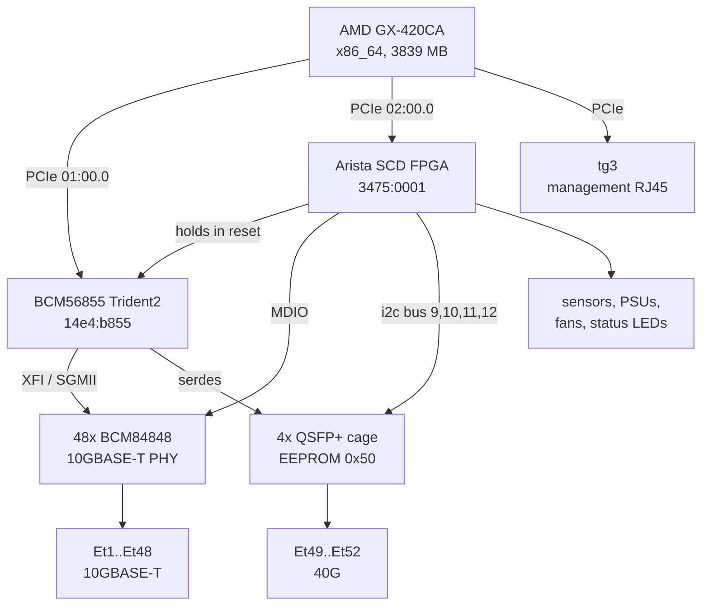
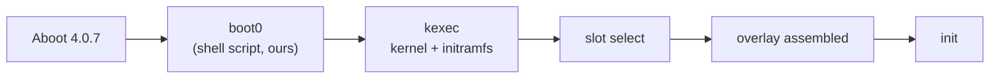

# Arista DCS-7050TX-64 — hardware reference

How this switch is built and how NOSaic drives it. Everything below was read off
a running unit; where a value has not been measured yet it says so rather than
carrying a plausible number.

⚠ **NOSaic has not booted on this board yet.** The measurements here come from
EdgeNOS, the predecessor project, which does boot it and forwards in hardware.
They describe the board, not a NOSaic port — see [todo.md](todo.md).

## At a glance

| | |
|---|---|
| ASIC | Broadcom BCM56855, Trident2 — PCI `14e4:b855` at `0000:01:00.0` |
| CPU / arch | AMD GX-420CA SOC, x86_64 |
| RAM | 3839 MB |
| Front panel | 48x 10GBASE-T (external BCM84848 PHYs) + 4x QSFP+ 40G |
| Management | 1x RJ45, tg3 |
| Platform controller | Arista SCD FPGA — PCI `3475:0001` at `0000:02:00.0` |
| Bootloader | Aboot 4.0.7, unsigned SWIs accepted |
| Console | `ttyS0`, 9600 8N1 |
| Board id | `sid=Yreka64`, `platform=crow` (from Aboot's kernel command line) |

## Block diagram

The two paths that matter are separate: the CPU reaches the **ASIC** directly
over PCIe, but reaches the **front-panel copper PHYs** only through the SCD.



⚠ **The SCD holds the Trident2 in reset from power-on.** Until it is told to let
go, `01:00.0` is not on the bus to be discovered. This is why the ASIC's address
is declared in `board.yml` rather than probed for.

The copper ports therefore need *two* things the QSFP ports do not: the PHY
firmware loaded over the SCD's MDIO, and the ASIC's MAC-side interface set to
match whatever the PHY negotiates on the wire.

## Boot chain



Aboot enforces no signing here and `boot0` is a shell script we control, so an
unsigned SWI boots. `boot flash:/<image>.swi` at the Aboot prompt is a
**one-shot**: `boot-config` is never modified, so the next power cycle returns to
the vendor OS by itself. That is the recovery path and the reason the EOS images
stay on flash.

Two things `boot0` does that the kernel cannot do for itself:

- **Reads the management MAC** and passes it on the command line. `tg3` comes up as the unprogrammed Broadcom default `00:10:18:00:00:00` across a kexec, so the address has to come from Aboot.
- **Reserves the DMA pool** via `memmap=64M$0xd0000000`. `0xd0000000` and not `0x100000000`: this board has 3839 MB, so 4 GB is past the end of memory.

## Port map

⚠ **This translation is defined here and nowhere else, and the rule is not
uniform across cage types.**

The 48 copper ports are regular:

```
front panel EtN  =  SDK port N  =  diag/tap name xe(N-1)
Et48             =  SDK port 48 =  xe47
```

The four QSFP cages are **not**. Each is the first lane of a group of four, so
the SDK numbers skip, while the Linux taps stay consecutive:

| front panel | SDK port | tap | i2c bus (EEPROM) |
|---|---|---|---|
| Et49 | 49 | `xe48` | 9 |
| Et50 | 53 | `xe52` | 10 |
| Et51 | 57 | `xe56` | 11 |
| Et52 | 61 | `xe60` | 12 |

Code that assumes one rule for both mis-maps the QSFP capacity, and it presents
as a dead port rather than as a wrong index.

The i2c bus numbers were measured by reading the SFF identifier byte (`0x00`) at
address `0x50` on each bus and seeing which answered `0x0d` (QSFP+).

⚠ **The ASIC-level port map itself is not in this repository.** The logical-to-
physical map and SerDes polarity were read out of the running vendor OS and are
not ours to distribute. `tools/` ships the generator; `config/portmap.conf` and
`config/polarity.conf` are gitignored, and the board reports the feature
unconfigured until somebody generates them against their own switch. A guessed
map satisfies every bandwidth rule the chip enforces and reaches none of the
right cages.

## Register and memory regions

| region | what NOSaic uses it for |
|---|---|
| ASIC BAR0 (`01:00.0` `resource0`) | the whole SDK register/memory space, mmap'd by the userspace BDE |
| `memmap=64M$0xd0000000` | DMA pool the BDE hands to the SDK |
| SCD `0x4000` | switch reset block — releasing the Trident2 |
| SCD `0x5000` | PSU presence and status GPIO (bit 0 = PSU1, bit 1 = PSU2) |
| SCD `0x6050`–`0x6080` | chassis status LEDs (status, fan, PSU1, PSU2) |
| SCD `0xA000` + n×`0x10` | per-QSFP-cage LEDs, per lane |
| SCD `0xA100`+ | QSFP transceiver control — **note the boundary**: the LED block ends at `0xA0F0`, and an off-by-one walks into transceiver control |
| SCD i2c adapters | 13 buses exposed to Linux by the `scd` driver; QSFP EEPROMs on 9–12 |
| BCM84848 MMD 1 / 7 | per-PHY control and autonegotiation, over SCD MDIO |

The SCD register layout is architecturally consistent across Arista platforms and
these offsets also appear in Arista's own published SONiC platform tree, so they
are public facts about the hardware rather than anything derived from a vendor
binary.

## Datapath

`nosd-td2` — not yet written. It should copy `datapath/td2p/` (same CMICm
generation, same architecture, same userspace-BDE approach) and reuse
`datapath/common/` rather than forking it. The known deltas:

- PCI device `0xb855` rather than `0xb860`.
- `internal/platformhal/scd/asic.go` hardcodes `cmicDevRevExpect` for Trident2+; it needs to be per-ASIC. That is a **core** change and belongs in its own commit.
- The 48 external PHYs have no counterpart on either existing board.

EdgeNOS drives this chip through Broadcom's OpenBCM SDK with a userspace BDE
over an mmap of BAR0 — the same shape NOSaic uses — and reaches hardware
forwarding for IPv4 and IPv6, OSPFv2/v3 adjacencies, and ECMP programmed as a
shared `bcm_l3_egress_ecmp` group. None of that is NOSaic code yet.

## Platform HAL

`driver: scd`, which NOSaic already implements for the 7050SX2. Expected to
carry over with different bit assignments: ASIC reset, temperature sensors, PSU
presence and status, status LEDs, watchdog, and the i2c adapters that reach the
QSFP EEPROMs.

Not yet established on this board: which reset bits, whether `fanread` is
trustworthy here (it is not on the SX2), and whether the prefdl SEEPROM can be
read for the management MAC and hardware epoch.

⚠ **Transceiver diagnostics may read as all zeros and that is not a fault.** The
QSFP+ modules in this box are Avago `AFBR-79EBPZ-CS2` active optical cables.
They carry an EEPROM and identify correctly, but populate no DOM: temperature,
voltage and per-lane RX power all read `0x00` — including on cages that are
linked at 40G and passing traffic. Treat zeros as "not reported", never as "no
light".

## Quirks

**A link with no speed is not a link.** Every *unconnected* copper port reports
`Link Up with Speed 0M`. Code that believes it configures all 48 ports as though
they were cabled.

**The MAC interface must follow the negotiated speed.** SGMII at or below 2.5G,
XFI at 10G. A 10GBASE-T port left at its XFI default while the copper side
negotiates 1G gives a PHY with a real link on *both* sides that bridges nothing,
in both directions, with zero errors on either end.

**MDIO is shared, and the datapath depends on it.** Polling
`bcm_port_speed_get` across all 48 PHYs every two seconds starved the bus and
killed copper RECEIVE on every port, while the direct-serdes 40G ports carried on
working. Cache link state from linkscan; bound every sweep.

**The PHY firmware handshake fails transiently on cold start.** One boot here
logged 40 handshake warnings and no copper port linked. Restarting the datapath
agent cleared it with zero warnings on the rerun, nothing else changed. It is a
transient of the firmware download, not a configuration fault — but a port that
never comes into service looks exactly like a dead cable.

**A port configured only at startup is a port that dies when cabled later.** The
predecessor configured ports in a single pass shortly after enabling them, so a
cable plugged in afterwards got no MAC interface, no VLAN and no L3 interface.
The symptom is indistinguishable from a broken cable: the link negotiates, both
ends transmit, neither receives, and there are zero errors on both sides.
Diagnose it by reading MMD `7.19`, the link-partner ability — `0x0000` on a port
whose neighbour reports carrier means our PHY was never brought into service,
not that a pair is broken.

**`boot flash:` is a one-shot.** A plain reboot returns to the vendor OS. That
is the safety property, not a bug, but it means "reboot the switch" and "reboot
into our image" are different operations.

## Reverse engineering

The investigation behind this page — traces, register captures, eliminated
theories, and anything derived from the vendor's own files — lives in a
**private** repository, `td2-7050tx64-reverse-engineering`, one per switch. It
is not public: it contains material read out of the running vendor OS.

What is *not* here and is in there: the SDK configuration capture, the board
description file and everything extracted from it (the cooling curve and the
retimer tuning), the port map and polarity values, and the full record of how
each finding above was established.
