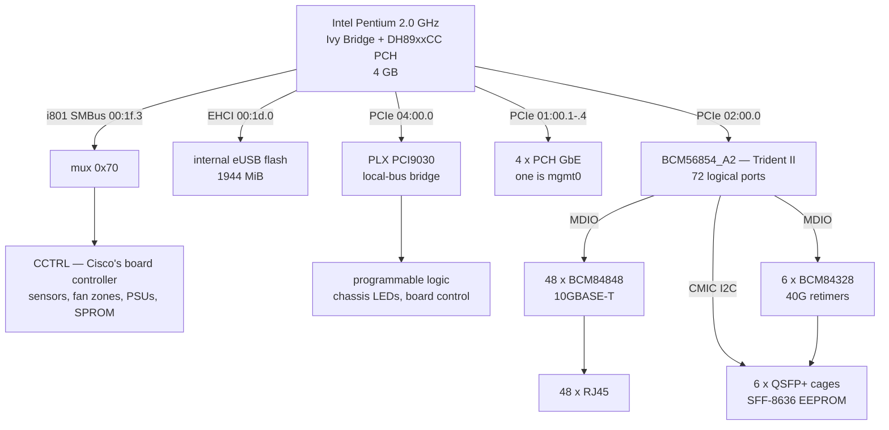
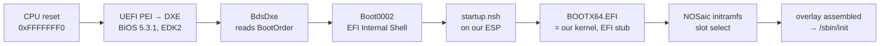

# Cisco Nexus 3172TQ — hardware reference

How this switch is built and how NOSaic drives it. The audience is somebody
changing the datapath or debugging silicon.

Everything here was recovered from a running N3K-C3172TQ-10GT and from its
firmware. Where a claim rests on a string in a binary rather than on an
observed transaction, it says so. The *investigation* — the traces, the dead
ends, the vendor-derived material — is in the reverse-engineering repository
linked at the bottom; this page is the board as NOSaic understands it.

## At a glance

| | |
|---|---|
| ASIC | Broadcom **BCM56854_A2** (`14e4:b854`, rev `0x03`), Trident II, driven by the `BCM56850_A0` base driver |
| CPU / arch | Intel Pentium @ 2.00 GHz, **x86_64** — Ivy Bridge core with a **DH89xxCC "Cave Creek"** PCH |
| RAM | 4 GB |
| Front panel | **48 × 10GBASE-T** + **6 × 40G QSFP+** = 54 ports, **72 ASIC logical ports** |
| Management | `mgmt0` at PCI **`01:00.1`** (`8086:0438`, `igb`), MAC `b4:de:31:3f:a5:c0` |
| Disk | **1944 MiB internal eUSB flash**, behind EHCI at `00:1d.0` |
| Bootloader | **UEFI firmware directly.** BIOS 5.3.1, EDK2, no Secure Boot machinery |
| Console | `ttyS0` @ **9600** |
| Board codename | **`quickzinc2`** (`qz2`) |
| Vendor OS | NX-OS 7.0(3)I7(9), `n3100-compact.7.0.3.I7.9.bin` |

## Block diagram



Four things in that picture are worth stating in words, because each of them
contradicts an assumption carried over from the Arista boards.

**There is no single platform bus.** Four transports, three owners: MDIO for the
PHYs (owned by the SDK), the ASIC's own CMIC I²C for the optic EEPROMs, the
PCH's SMBus behind CCTRL for sensors/fans/PSUs, and 32-bit MMIO over a
PLX-bridged local bus for chassis LEDs and board control. On the 7050TX-64 the
SCD is a single place to go for almost all of that.

**The optic bus is on the ASIC side, not the board-controller side.** This is
the inverse of the Arista arrangement and it is the easiest thing here to get
backwards. The vendor reaches a QSFP page/byte through its user-space switch
driver, not through CCTRL.

**The 40G cages are retimed.** Six BCM84328s sit between the ASIC SerDes and
the cages, one per cage on the first lane of each group of four. That is why
there is no SerDes tuning data anywhere for this board (see
[No SerDes tuning](#no-serdes-tuning)).

**The disk is USB.** Not SATA, despite two IDE-class controllers being present
on the PCH. A kernel without USB mass storage built in reaches userspace and
has no root filesystem.

## Boot chain



And the path for trying an image without touching the disk, which is where a
bring-up on this board should start — ⚠ **not** over the network, for the
reason in [Netbooting is not possible here](#netbooting-is-not-possible-here):


See [install.md](install.md#test-it-from-a-usb-stick-instead).

What the vendor does instead, and why we do not:What the vendor does instead, and why we do not:

```
BdsDxe → Boot0000 "EFI Payload" → Cisco loader (GRUB in the BIOS flash)
       → mknbi-linux NBI container → NX-OS bzImage
```

### The vendor loader, and why it is not in our path

Cisco's `loader>` prompt is a customised GNU GRUB 2, built as a **PE32+ x86-64
EFI application** (735,744 bytes, version `4.0.0i(eng)`) and stored **inside the
BIOS flash** at `0x400000` — there is no EFI system partition on the vendor's
disk at all. `Boot0000`'s FFS GUID is exactly that file's, which is why
**Ctrl-L** at BIOS time reaches a loader prompt on a disk with no ESP.

It keeps stock GRUB's core — `grub_file_open`, the relocator, the whole
`grub_efi_*` layer, `grub_load_linux`, `big_linux_boot` — and replaces
everything a user would recognise. No `grub.cfg`, no menu, no module directory,
and **no `grub_net` at all**. Cisco's additions are namespaced `rom*`: a second
parallel command registry (`grub_register_rom_command`), their own kernel
placement (`rom_loader_linux_boot`, `romrelocator`), their own TFTP client
(`tftp_addr`, `tftp_buffer`), a Signature Envelope verifier, and the NBI
container loader (`load_tagged_image`, `nbi_parm`, `imghdr`).

Its `?` lists eight commands. The binary contains **29 `usage:` blocks**. The
ones that matter for recovery are in [install.md](install.md).

**It will not boot a bare kernel.** Handed one over TFTP it refuses with

```
error: invalid magic number expected 0x1b031336 got 0x7ea5a4d.
```

`0x1b031336` is the `mknbi` NBI magic, and an NX-OS image's own first bytes are
that magic followed by the string `mknbi-linux-1.2-`. So the vendor's image
format is a container built by a real, still-archived open-source tool rather
than a format to reverse.

**And that route is a dead end today.** Wrapping our own kernel is not the
problem; two constraints were measured and both satisfied:

- **The loader parses at most four segment descriptors.** Cisco's images have
  exactly four; stock `mknbi-linux 1.2-7` emits five or six, and the fifth
  parses as garbage — `error: Load Address Range Check Failed`. Rebuilt in
  Cisco's own two-segment shape (`vtag 17` = the boot sector at `0x94000`,
  `vtag 20` = setup remainder and kernel at `0x100000`), it validates.
- **There is an address floor** somewhere between `0x82800` and `0x92800`: the
  same first descriptor is refused at the lower address and accepted at the
  higher.

With both satisfied, the transfer completes at 3.7 MB/s, the container
validates, the loader prints `CardIndex = 11091` — and the board **resets**.
A normal NX-OS boot continues past that point with `Image valid`; ours never
reaches it. Nobody has established why.

So NOSaic steps around the loader entirely. That is not a workaround born of
frustration: it is the shorter path, because the firmware underneath will launch
our kernel with nothing in the way.

### Nothing verifies anything

Two questions get conflated here and they have different answers.

**Who verifies the loader: nobody, and it is not switched off — it was never
built.** Searched across the whole 8 MB firmware image:

| searched | hits |
|---|---|
| `EFI_IMAGE_SECURITY_DATABASE` GUID (`db`/`dbx`) | **0** |
| `EFI_CERT_X509` / `EFI_CERT_RSA2048` / `EFI_CERT_TYPE_PKCS7` GUIDs | **0** |
| `EFI_TCG_PROTOCOL` / `EFI_TCG2_PROTOCOL` GUIDs | **0** |
| variable names `PK`, `KEK`, `db`, `dbx` (UTF-16) | **0** |
| `SecureBoot`, `SetupMode`, `AuditMode`, `DeployedMode`, `VendorKeys` | **0** |

UEFI Secure Boot cannot be enabled without a Platform Key, by specification.
There is no PK, nowhere to put one, and no certificate or measurement code to
use it. The DXE volume ships **`SecurityStubDxe`** — EDK2's no-op security
policy — and no image-verification module. Every one of the 37 UEFI variables
has attributes `0x0007`; not one carries `0x20` `AUTHENTICATED_WRITE_ACCESS`,
so nothing in the store is even capable of being an authenticated variable.
No `TcgDxe`, no `Tcg2Dxe`, no TPM.

**Who verifies the OS image: the loader, and only the OS image.** The Signature
Envelope verifier is compiled into the loader — RSA with primary and rollover
key storage, SHA-512, revocation. The chain is therefore:

```
firmware ──(no check at all)──> loader ──(RSA Signature Envelope)──> NX-OS image
```

The unverified component is the one doing the verifying. And there is no
hardware to enforce either link: **no IOFPGA, no MIFPGA, no ACT2** — all three
FPGA BAR module parameters read `0`. Where the N9K's IO FPGA is its secure-boot
enforcer, this board has no hardware trust anchor at all, which is why Cisco's
trust anchor on this platform is software.

> **What that means for us:** running our own code here is a packaging problem,
> not a signing problem. It also means nothing protects this board from a bad
> firmware write — the loader has a `flwr` command that programs either
> bootrom. Do not run it.

### Why the EFI Shell is in our boot path

`BootOrder` as shipped:

```
Boot0000  ACTIVE  "EFI Payload"         FV_FILE(b43bd3e1-…)   <- the Cisco loader
Boot0001  ACTIVE  "EFI Network"         FV_FILE(acc9491e-…)
Boot0002  ACTIVE  "EFI Internal Shell"  FV_FILE(c57ad6b7-…)   <- standard EDK2 shell
Boot0003  ACTIVE  "EFI USB Device"      ACPI / PCI / USB / USB
Boot0004/5        duplicates of 0000 and 0001
```

`Boot0002` and `Boot0003` are already active, so neither has to be enabled.

The EFI stub takes its command line from the firmware's LoadOptions, and a boot
entry created with the shell's `bcfg boot add` carries none — so a kernel
launched from a plain boot entry comes up with no `console=` and no `initrd=`,
and says nothing about either, on a serial console that is not configured. The
shell *does* pass arguments, and it auto-runs `startup.nsh`.

So NOSaic's EFI system partition carries a `startup.nsh` that iterates `fs0`
through `fs3`, finds the one with `\EFI\BOOT\BOOTX64.EFI` on it, and launches
the kernel with a full command line. It iterates rather than hardcoding `fs0`
because inserting a USB stick renumbers the aliases, and a script that says
`fs0` would then boot the stick or nothing.

This is an unusual arrangement and it is temporary. The tidy ending is a real
`Boot####` entry whose optional data carries the command line as UCS-2, written
with `efibootmgr` from the running switch — which is why `CONFIG_EFIVAR_FS` is
in the x86_64 kernel fragment. [todo.md](todo.md) carries it.

## Netbooting: the loader does it, iPXE cannot

Two independent network paths, tested on the hardware on 2026-09-17. One is
alive and one is a dead end, and it is worth being precise about which.

### The vendor loader's own TFTP — alive, and it loads our kernel

This is the path. `boot tftp://<server>/<file>` moves data fast (5.3 MB across
a subnet boundary at 3.7 MB/s) and accepts only an `mknbi-linux` NBI container.
**Wrapping our image in one now works**, and the loader gets further than
anything before it:

```
loader> debug 3
loader> cmdline console=ttyS0,9600n8 earlyprintk=serial,ttyS0,9600
loader> boot tftp://10.22.1.5/nosaic.nbi

NBI header
magic: 1b031336, len: 54, location: 94400000, exec addr: 92800000
segment header  vendor: 0x11  loadaddr: 0x94000    image len: 512
    Reading data for kernel param. Len 512
segment header  vendor: 0x14  loadaddr: 0x100000   image len: 14246400
    Loading kernel length 14246400
    Kernel loaded successfully
segment header  vendor: 0x15  loadaddr: 0x4000000  image len: 67579836
    Loading intird 67579836
big_linux_boot
Image length: 81827260 bytes
(c) Copyright 2018, Cisco Systems.          <- the board resets here
```

So: **the container is accepted, the kernel loads, the initrd loads, and our
command line reaches the kernel parameters.** The board then resets at the
handoff, with no kernel output at all — not even `earlyprintk`, which would
speak from the decompressor if it ran.

**The container recipe that gets this far**, built by
`cisco-re/tools/nbi_build.py` and matching the vendor's own image
byte-for-byte in shape:

| segment | vtag | load | contents |
|---|---|---|---|
| 0 | **17** | `0x94000` | `bzImage[0:512]` — the loader reads this as the kernel parameter block |
| 1 | **20** | `0x100000` | `bzImage[512:]`, memory length = the setup header's `init_size` |
| 2 | **21** | `0x4000000` | the initramfs |

with header `exec addr 0x92800000`, `location 0x94400000` and vendor string
`mknbi-linux-1.2-6`. Two constraints from earlier work still hold: **at most
four segment descriptors**, and a load-address floor between `0x82800` and
`0x92800`.

### Six hypotheses tested and eliminated

Each looked like the answer. All of this was settled by reading the vendor's
own kernel out of its NBI and booting ours with the variables removed, which is
cheaper than guessing and is why none of it cost a kernel rebuild.

**The exec address is not it.** `0x92800` is mknbi's `first32pm` stub address
and nothing in our image loads there — but the **vendor's own image has the
identical exec address** (`0x92800000`) and boots, so the loader does not jump
there.

**`setup_sects` is not it.** Ours is **39**, so `bzImage[512:]` begins with
setup code rather than the kernel, and the loader puts that at `0x100000`.
Decisive-looking until the vendor's kernel was read: **`setup_sects = 30`**,
the same situation, and it boots.

**KASLR is not it.** `nokaslr` fails identically — same `big_linux_boot`, same
reset. (And the vendor's config has no `CONFIG_RANDOMIZE_BASE` at all, so it
was a real difference; just not this one.)

**The EFI handover protocol is not it.** Our `xloadflags` is `0x7f` with
`XLF_EFI_HANDOVER_32/64` set and the vendor's is `0x0`, so "the loader takes
the handover path for ours and the legacy path for theirs" was a good theory.
The loader's own symbols kill it: it is built from **`loader/i386/linux.c`** —
GRUB's *legacy* i386 Linux loader — and carries `grub_relocator16_boot`,
`grub_relocator16_cs/ip/ds/es/fs/gs`, and `big_linux_boot: ASM code execute >>`.
It drops to **16-bit real mode**. There is no handover path and `xloadflags` is
never consulted.

**Relocation and load address are not it.** The vendor kernel's own config,
extracted from its `IKCFG_ST` blob, is the same as ours in every field that
decides where a kernel may be loaded:

| | vendor 3.4.91 | ours 6.12.105 |
|---|---|---|
| `CONFIG_RELOCATABLE` | **y** | y |
| `CONFIG_PHYSICAL_START` | **0x1000000** | 0x1000000 |
| `CONFIG_EFI_STUB` | **y** | y |
| `CONFIG_PHYSICAL_ALIGN` | 0x1000000 | 0x200000 (looser) |
| `CONFIG_RANDOMIZE_BASE` | not set | y (ruled out above) |
| `relocatable_kernel` (header) | 1 | 1 |

So `CONFIG_RELOCATABLE=n` with `CONFIG_PHYSICAL_START=0x100000` — which was the
queued next experiment, and would have needed per-board kernel fragments that
do not exist — is pointless: the kernel this loader **does** boot is
relocatable and linked for 16 MB, exactly like ours.

**The initramfs is not it.** Booting a **two-segment** NBI with no ramdisk
segment at all fails identically: `Kernel loaded successfully`,
`big_linux_boot`, reset. So nothing about the ramdisk — its size, its address,
its format — is implicated.

### What is left

The handoff itself, and the difference is the kernel's own vintage rather than
anything about how it is packaged. Our boot protocol is **2.15**; the vendor's
is **2.11**. The loader reads **only 512 bytes** as the parameter block
(`Reading data for kernel param. Len 512`), and a modern setup header runs to
`0x268` — so everything from `initrd_addr_max` upwards is in bytes it never
copies. Our real-mode setup is 20,480 bytes against the vendor's 15,872, and
the loader's own real-mode window is small: the NBI header lives at `0x94400`,
only 1 KiB above where the boot sector is placed at `0x94000`.

**The next step is disassembly, not another boot.** `big_linux_boot` is in the
loader's symbol table, `cisco-loader-4.0.0i.efi` is extracted, and what it
writes into `boot_params` and where it far-jumps is readable. Black-box
bisection has taken this as far as it goes.

**And the USB path is now the better test of the kernel itself**, because the
EFI stub does not involve the loader's `boot_params` at all — see
[install.md](install.md#test-it-from-a-usb-stick-instead). Both kernels have
`CONFIG_EFI_STUB=y`, so that route is known to be viable on this firmware.

### The embedded iPXE — a dead end, and not the same thing

Reached with `loader> ipxe` (⚠ see below) or boot option 4. It fetches
perfectly and executes nothing:

```
Cisco iPXE / iPXE 1.0.0+ (ffd9)
Features: HTTP DNS TFTP NBI Menu

iPXE> imgstat
vmlinuz : 14246912 bytes
iPXE> imgselect vmlinuz
Could not select: Exec format error (http://ipxe.org/2e008081)
```

`imgstat` lists the image with **no type**, so the format probe matched
nothing: no bzImage loader and no EFI image loader. NBI is in the feature list
and is a legacy real-mode format an iPXE running as a UEFI application cannot
execute either. And `Boot0001 "EFI Network"` *is* this iPXE out of the firmware
volume — Cisco's `NetBoot` DXE module — not a generic PXE client that could be
handed better firmware. So this path cannot be fixed from our side.

### ⚠ `loader> ipxe` is a persistent boot-mode change, and it has no undo

Its help text says "On Reboot boot ipxe". What it does is set the boot mode to
**PXE boot only** — and in that mode the firmware **skips the loader entirely**,
so there is no `loader>` prompt left to change it back with. The box boots a
failing iPXE loop indefinitely. Proven by the loader on the way back out:

```
loader> bootmode -g
Current Boot Mode is: PXE boot only
Set Boot Mode to: GRUB boot only
```

### The BIOS boot menu is the escape hatch, and it overrides the boot mode

The most useful thing in this firmware. During POST the BIOS prints `Press TAB
in 5 seconds to list all boot options`, and TAB gives:

```
Boot Options :
  [ 1 ] - EFI Payload          <- the Cisco loader
  [ 2 ] - EFI Internal Shell
  [ 3 ] - EFI USB Device
  [ 4 ] - EFI Network
```

It reaches any of the four regardless of the boot mode, which is what recovered
the box: TAB → `1` → Ctrl-L → `bootmode -g`.

### A platform finding that fell out of `debug 3`

The loader probes the platform bus before classifying the image, and it prints
every transaction — which is free information about the i2c topology that the
running OS hides:

```
Using PCI Interrupt for SMBus.   SMBus BAR = efa0
selecting mux addr 1
smbus access: addr 0x73 ... WRITE cmd 1 data 1
smbus access: addr 0x70 ... WRITE cmd 1 data 1
smbus access: addr 0x52 ... READ  -> 0x2b, 0x53 ...
CardIndex = 11091
```

⚠ **There are two muxes, not one.** `0x73` as well as the `0x70` the running
system's logs show, both written with channel select `1`. And the board
identity EEPROM answers at **`0x52`** — which is where `CardIndex = 11091`
comes from. That is three addresses the platform HAL needs and
[`tools/mki2cmap.sh`](../tools/mki2cmap.sh) should expect to find. It also
means `debug 3` at the loader is a way to watch platform i2c with no OS in the
way at all.

The loader also names the image type it decided on — `ImageType IMG_INSIEME`
for ours — and stages the download at `memptr=0x20000000` with
`memptr_initrd=0x5000000` before parsing it.

## The vendor's kernel and ramdisk, for comparison

Both were extracted from the NBI in `cisco-firmware/nexus3172tq/`, since the
segment payloads are contiguous in the file behind the 1024-byte header.

**The kernel is Wind River Linux**: `3.4.91-WR5.0.1.13_standard+`, 5.5 MiB,
gzip-compressed payload at protected-mode offset `0x2cd`. It has
`CONFIG_IKCONFIG` enabled, so its **full 977-symbol configuration is
recoverable** — saved in the RE repository at
`analysis/kernel/nxos-3.4.91-WR5.0.1.13.config`. That is what made the
relocation question answerable without guessing.

**The ramdisk is not a Linux initramfs.** 445 MiB, 7.99 bits/byte of entropy
from the first byte, no `070701` cpio magic and no filesystem superblock at the
front — Cisco's own packed system image. Which is itself worth knowing: the
loader treats the vtag-21 segment as an **opaque ramdisk**, placing it and
setting `ramdisk_image`/`ramdisk_size` without caring what is in it. So an
ordinary `cpio.gz` initramfs is a valid thing to hand it, and ours is:

```
16 entries
  bin/busybox            2,282,760    with the i2c applets
  init                      20,635    the slot-select and overlay script
  nosaic-rootfs.sqsh    66,408,448    the root filesystem, for a RAM boot
```

## Port map
## Port map

**The translation is defined in exactly one place: `config/portmap.conf`, and
that file is generated, not committed.** See [The port map is the
vendor's](#the-port-map-is-the-vendors) below for why, and `tools/mkportmap.sh`
for how.

The shape of it, which is not vendor data and is worth knowing before reading
a generated file:

| front panel | ASIC logical | physical (SerDes lane) | speed | PHY |
|---|---|---|---|---|
| `Eth1/1` … `Eth1/48` | 1 … 48 | 13–16, 21–32, 45–76 | 10G | BCM84848, one per port |
| `Eth1/49` | **49** | 77 | 40G | BCM84328 (cage master) |
| `Eth1/50` | **53** | 81 | 40G | BCM84328 |
| `Eth1/51` | **57** | 97 | 40G | BCM84328 |
| `Eth1/52` | **61** | 101 | 40G | BCM84328 |
| `Eth1/53` | **65** | 105 | 40G | BCM84328 |
| `Eth1/54` | **69** | 109 | 40G | BCM84328 |

⚠ **THE FRONT-PANEL NUMBER IS NOT THE LOGICAL PORT ABOVE 48.** A QSFP cage
occupies four consecutive logical ports even when it runs as a single 40G port,
so the six cages are logical 49, 53, 57, 61, 65 and 69 — not 49 to 54. Using
the panel number instead configures a port in the middle of the previous cage.
It is a real port, it will not link, and nothing says why. This is the same
trap the 7050TX-64 documents, one cage wider.

⚠ **PHYSICAL LANE NUMBERING HAS GAPS, AND THERE ARE THREE OF THEM.** The 48
copper ports occupy lanes **13–16, 21–32 and 45–76** — so 17–20 and 33–44 are
skipped entirely. The six cage masters are 77, 81, 97, 101, 105 and 109, which
skips 85–96 as well.

That is TD2 SerDes-lane numbering as this board wires it, and it is exactly the
kind of discontinuity a sequential guess gets wrong while satisfying every
bandwidth rule the chip enforces — so the failure looks like working. Counted
rather than described: 4 + 12 + 32 = 48.

⚠ **MDIO ADDRESSES ARE SWAPPED IN PAIRS.** `xe0` answers at address 1, `xe1` at
0, `xe2` at 3, `xe3` at 2. Get this wrong and the SDK talks to a real PHY
belonging to a different socket, so a port reports another port's link state.
Nothing errors.

The vendor's ASIC sees all 72 logical ports and its own bitmap says so
(`pbmp_xport_xe=0x1fffffffffffffffffe`, bits 1–72), with the 18 subordinate
lanes flagged `:i`. NOSaic runs the cages as one 40G port each — 54 ports,
`pbmp_xport_xe.0=0x222223fffffffffffe` in [`config/asic.conf`](../config/asic.conf).
`config/portmode.conf` is where a cage is asked to break out into four 10G
ports instead.

### The port map is the vendor's

The SDK cannot bring up a single port without knowing which logical port
reaches which physical lane, and on this board it cannot reach a front-panel
port at all without each PHY's MDIO address. Neither is published anywhere for
this machine. Both were read out of the vendor's own running SDK:

```
bcm-shell.0> config show
```

That prints **568 soc properties**, 72 of them portmap entries, plus PHY
assignment, MDI pair swaps, per-lane polarity flips and per-core lane swizzles
— the vendor's equivalent of our hand-maintained `portmap.conf`, readable in
one command. Which makes it vendor-derived, so NOSaic ships the generator and
not its output, the same rule the Arista boards follow.

What *is* in `asic.conf` is the 30-odd properties that describe the ASIC as
this model configures it rather than as this unit is wired. Those are the same
class of data the sibling board ships committed.

### No SerDes tuning

The Arista 7050TX-64 needs `serdes.conf` and `retimer.conf`, and both are
generated because they cannot be reconstructed. **This board needs neither**,
and the reason is architectural rather than lucky: every front-panel port has a
PHY in front of it, including the 40G cages, so nothing drives a channel
directly off the ASIC SerDes. No preemphasis and no TX-FIR coefficients appear
anywhere in the vendor's configuration for this board.

The corroborating detail is that the SerDes library *named for this platform* is
a stub: `libsrdscfgn3k.so` is 4 KB and its lane accessor returns `NULL`, while
its siblings for other platforms run to 178 MB. The board's lane data lives in
the SDK's soc properties instead.

`polarity.conf` is still needed — the board does invert lanes
(`phy_xaui_rx_polarity_flip_<n>`) and swizzle them per core
(`xgxs_{tx,rx}_lane_map_xe<n>`). `tools/mkpolarity.sh` generates it from the
same capture as the port map.

## Register and memory regions

### The ASIC

`14e4:b854` at `0000:02:00.0`, BAR0 256 KiB — the CMIC. Reached exactly as on
every other NOSaic board: the BDE maps the PCI BAR from userspace, and
`CONFIG_UIO_PCI_GENERIC` delivers INTx so the SDK does not fall back to a
polling thread. Nothing board-specific.

Worth recording for comparison: the vendor reaches the same chip through the
**stock Broadcom BDE kernel modules** (`linux_kernel_bde`, `linux_user_bde`,
`linux_bcm_knet`, `linux_uk_proxy`) and can only do so because NX-OS here runs
kernel **3.4.91**, far below the BDE's 4.16 ceiling. NOSaic runs 6.12 and
supplies its own small userspace piece instead. Both put the SDK in userspace;
the difference is what is underneath.

### The PCH SMBus, and the mux

```
i801_smbus 0000:00:1f.3: enabling device (0001 -> 0003)
```

One kernel adapter — `i2c-0`, "WML SMBus adapter a" — and **everything else
behind a single mux at `0x70`, selected per access**. The vendor exposes no
`/dev/i2c-*`: access goes through its own `klm_i2c`, whose real code is inside
the 2.4 MB `klm_cctrli`.

Only channels 2 and 4 have been observed, and only as failures:

```
pfmclnt/26477 - failed to set mux addr 0x70 ch 2 err I2C_ERR_NO_RESPONSE
pfmclnt/26477 - failed to set mux addr 0x70 ch 4 err I2C_ERR_NO_RESPONSE
```

`NO_RESPONSE` is what an empty socket looks like, and this chassis has no
optics fitted and a dead PSU 1 — so at least two channels legitimately have
nothing on them. **Successful selections are not logged, so the channel-to-
device table is not established.** That is why `board.yml` declares no i2c map:
a wrong channel does not fail, it reads a device that is not there.

### The PLX local bus — chassis LEDs and board control

`10b5:9030` (PLX PCI9030, a local-bus-to-PCI bridge) at `0000:04:00.0`, with a
second bridge `10b5:8112` at `03:00.0` above it. Its windows:

| BAR | address | size | |
|---|---|---|---|
| 0 | `0xc4700000` | 128 B | the PLX's own control registers |
| 1 | `0x2000` | 128 B | I/O space |
| **2** | `0xc4400000` | **2 MB** | local bus |
| **3** | `0xc4200000` | **2 MB** | local bus |
| **4** | `0xc4000000` | **2 MB** | local bus |
| **5** | `0xc0000000` | **64 MB** | local bus |

The vendor's access is plain 32-bit MMIO: `brd_ctrl_rd(offset, *out)`
disassembles to six instructions — load a global base, add the offset, do a
32-bit load. The base comes from kernel module parameters
(`/sys/module/klm_card_index/parameters/{iofpga_bar0,mifpga1_bar0,mifpga2_bar0}`),
and **on this board all three read `0`** — there is no IOFPGA and no MIFPGA, so
the general path finds nothing and the programmable logic is reached through
the PLX instead. Nothing holds those windows mapped persistently, so access is
on demand.

**Which offsets in those windows are the chassis LEDs is not known.** Our
equivalent on the Arista is SCD `0x6050`–`0x6080`. Front-panel *port* LEDs are
a different thing: they belong to the ASIC and the SDK drives them, as in
`datapath/*/led.c`.

## Datapath

`nosd-td2`, unchanged. This board's silicon is `BCM56854_A2` driven by
`BCM56850_A0` — the same base driver family as the 7050TX-64's `BCM56855`, same
A2 stepping, adjacent SKUs. Independent confirmation from the vendor's own
banner:

```
Chip=BCM56854_A2 Rev=0x03 Driver=BCM56850_A0
```

That is the assumption `datapath/td2` rests on, stated by the vendor's SDK
rather than inferred by us.

`datapath/td2/phy.c` is the piece that carries over most directly and matters
most: 48 ports of 10GBASE-T behind BCM84848s, with firmware downloaded over
MDIO at init. Two pieces of evidence that this is the hard part rather than a
detail:

- Cisco's SDK is stock Broadcom 6.4.8 plus **217 private patches**, and the
  manifest is recoverable from `libbcm_sdk.so`. Of the 14 patches with no
  Broadcom SDK case number, **eight carry `PHY-nnnn`** — Broadcom's separate
  PHY case tracker — on a 10GBASE-T box. The vendor needed eight PHY fixes on
  the same class of hardware.
- NOSaic builds **6.5.24**, which post-dates almost all of those backports. We
  get by version what Cisco got by backporting, which is the concrete reason
  being on the newer SDK is worth more than the version numbers suggest.

**Capabilities.** Nothing is advertised yet, because nothing has run. The Field
Processor geometry is measured on this chip and is the one number worth having
in advance:

| stage | TCAM entries | slices |
|---|---|---|
| Ingress | **4096** | 12 |
| Egress | 1024 | 4 |
| Lookup | 1024 | 4 |

Slice entry counts come back as both 256 and 512, so a wide key costs a slice
twice what a narrow one does — the same double-wide-costs-more behaviour NOSaic
measured on Trident+ one generation earlier, which is a good sign the ACL model
in `datapath/common/acl.c` carries over.

## Platform HAL

**There is none yet, but the path to one is in the image.** Everything
auxiliary hangs off Cisco's board controller, **CCTRL** — their SCD — and that
is a 2.4 MB kernel module we have neither source nor register map for.

⚠ **CCTRL is a software layer, not a chip we cannot reach.** This is the thing
to get straight before concluding the board is closed. The sensors, the fan
controller, the power supplies and the SPROM are ordinary i2c devices behind an
ordinary mux on the PCH's i801 SMBus. CCTRL is the vendor's abstraction over
them. Linux can address the same parts directly, and the kernel NOSaic builds
now carries what that takes:

```
CONFIG_I2C_I801=y          the PCH's SMBus -- an i801, not the PIIX4 the
                           Arista boards use
CONFIG_I2C_MUX=y           the mux at 0x70, which everything is behind.
CONFIG_I2C_MUX_PCA954x=y   ⚠ binds to nothing on its own here: x86 has no
                           device tree and this board's ACPI does not
                           describe a mux, so a HAL instantiates it through
                           new_device. Probing needs no driver at all.
CONFIG_GPIOLIB=y           ⚠ the mux driver needs it and no x86 defconfig
                           sets it
CONFIG_HWMON=y             so a bound sensor is readable
CONFIG_SENSORS_*=m         a shortlist, as modules, pending identification
CONFIG_PMBUS=m             how a PSU reports voltage, current and its own fan
```

and the image carries busybox's `i2cdetect`, `i2cget`, `i2cset`, `i2cdump` and
`i2ctransfer`, with `tools/mki2cmap.sh` to walk the mux. What is missing is the
channel-to-device table, and [the netboot](#netbooting-it-first) is the only
time the bus is both reachable and not owned by somebody else's driver.

What is known about the shape of it:

| subsystem | transport | vendor owner | addressing |
|---|---|---|---|
| PHYs | MDIO | the SDK (`phy8481`) | port → MDIO address, swapped in pairs |
| QSFP EEPROM | I²C **via the ASIC's CMIC** | `t2usd` | port → SFF-8636 page + byte |
| Sensors | I²C via CCTRL | `dc3_sensor` | mux `0x70` → channel |
| Fans / PSUs | I²C via CCTRL | `pfm` / `pfmclnt` | mux `0x70` → channel |
| Chassis LEDs / board control | 32-bit MMIO over the PLX local bus | `libepldspi` inside `t2usd` | base + offset |

**Sensors.** Four of them, enumerated by CCTRL rather than probed as raw I²C
devices, interrupt-driven with sample filtering — a sensor that does not produce
enough good samples in a cycle is skipped rather than trusted. The ASIC die
sensor is a separate path, fetched through the switch driver rather than from
CCTRL, and it is the hottest thing on the box at around 55 °C idle.

**Thresholds come from the SPROM, not from a table.** Two-tier: generic defaults
compiled into the card-config library give all three board sensors an identical
50/60, and the live box reports three *different* minor trip points — 60, 56 and
46 against a common major of 70. A static table cannot produce that. The ASIC
sensor takes the table value (100/110) and the board sensors take the SPROM's.
The numbers are in `board.yml` for whoever writes the HAL.

**Fans.** Four `NXA-FAN-30CFM-F` trays, driven in **zones** with a PWM floor,
and — unlike ours — **closed-loop against the tachometer**:

```
Fan tray %d inst %d speed is below expected range. %d rpm expected. %d rpm read.
```

Airflow direction is read from the hardware with a fallback to front-to-back.
Commanding a duty and checking the tachometer agrees is the difference between
noticing a seized fan and not, and it is the thing from this board most worth
copying.

**PSUs.** Two `NXA-PAC-500W`. Presence, health, redundancy mode *and the PSU's
own fan* are modelled separately — the dead supply in the lab unit reports three
ways. Our equivalent on the Arista is a single GPIO word giving presence and
nothing else.

**Board identity.** The SPROM, behind the mux, and one of the addresses
`mki2cmap.sh` will find. `quickzinc2_sensor_specific` in
`libcrdcfgdatan3k_qz2.so` is a plain `.rodata` record array — a 16-byte
space-padded name, a threshold pair and an index — with a header carrying card
type `0x31` (49) and the sensor count 4. Decoding the SPROM itself is the way
to a MAC address and a serial number read from the hardware rather than from
configuration.

## Quirks

**The disk is USB, and a SATA-only kernel finds nothing.** `/proc/partitions`
shows `sda` at 1,990,656 1 KiB blocks behind the PCH's EHCI controller, and the
EFI shell's device path confirms it:
`PciRoot(0x0)/Pci(0x1D,0x0)/USB(0x0,0x0)/USB(0x0,0x0)`. Two IDE-class
controllers are present on the PCH (`8086:2321`, `8086:2326`) and neither
carries the boot disk. `x86_64_defconfig` builds in `USB_STORAGE` and
`USB_EHCI_HCD`, which is the only reason this is not a kernel patch.

**The management port needs `igb`, and `igb` is not in `x86_64_defconfig`**
although `e1000e` and `tg3` are. `CONFIG_IGB=y` is in the fragment. Without it
the port comes up with no driver bound and nothing in `dmesg` mentioning a
network device, which reads as dead hardware.

**Two of the four PCH "Ethernet controllers" are not ports.** See [The
management port](#the-management-port) — they report class `0x020000` and are
`DH8900CC Null Device`. Believing the class code costs a search for a driver
that does not exist and is not needed.

**`kernel_params` must survive to the kernel, and on this board that means a
shell script.** A `Boot####` entry made with `bcfg boot add` carries no optional
data, so a kernel launched from one gets no `console=` — on a 9600 serial
console that is a silent boot. The mechanism is `startup.nsh`; the explanation
is in [Why the EFI Shell is in our boot path](#why-the-efi-shell-is-in-our-boot-path).

**The console is 9600, and the sibling board in the same lab is 115200.** A
getty at the wrong speed reconfigures the port and makes everything after it
unreadable. Both switches are 1U Ethernet boxes with an RJ45 console on the
front and they look identical.

**Installing removes `bootflash:`.** NOSaic's GPT layout replaces the vendor's
MBR one, and the NX-OS image lived on `sda3`. There is exactly one NX-OS image
on the chassis — `sda1` is empty apart from `lost+found`, formatted 2018-03-20 —
so there is no second copy to fall back to. Have the image off the box before
starting.

**The loader autoboots about two seconds after its prompt appears.** Any
sequence that reconnects to the console between catching the prompt and sending
a command loses the window; both have to happen on one connection. And a console
server that replays a backlog on connect will hand you a *stale* `loader>` that
matches instantly and fires your command into a running NX-OS — match only a
prompt that is the last thing on the wire, after this boot's BIOS banner.

**The vendor's diag shell listens on `0.0.0.0:56000` with no authentication at
all** — `libusd.so` does `accept()` and `read()` and never calls
`getpeername`. It is unreachable off the box only because `mgmt0` sits in a
different network namespace. Worth knowing if you ever run the vendor OS on a
network you care about; not our problem once NOSaic is on it.

**`flwr` in the loader writes the BIOS.** "Burn new bios on either primary or
secondary bootrom". Nothing outside the BIOS checks the BIOS on this board.
Recorded so that nobody discovers it by accident.

## The management port

Resolved on the hardware. Four functions sit on the PCH at `01:00.1` through
`01:00.4`, alongside a QuickAssist co-processor at `01:00.0`, and **only one of
them is a management port**:

| function | device ID | class | what it is | driver bound by NX-OS |
|---|---|---|---|---|
| **`01:00.1`** | `8086:0438` | `0x020000` | **DH8900CC Gigabit Network Connection — `mgmt0`** | **`igb`** |
| `01:00.2` | `8086:0438` | `0x020000` | a second GbE, no connector | none |
| `01:00.3` | `8086:0436` | `0x020000` | **`DH8900CC Null Device`** | none |
| `01:00.4` | `8086:0436` | `0x020000` | **`DH8900CC Null Device`** | none |

⚠ **THE CLASS CODE LIES ON TWO OF THEM.** All four report class `0x020000`,
Ethernet controller, which is what the EFI shell's `pci` command prints and
what made this look like four network ports with two of them unsupported.
`8086:0436` is `DH8900CC Null Device` in the PCI ID database — a placeholder
function the PCH exposes for GbE that the board does not populate. It is not a
port, no driver claims it, and none should. Chasing the missing PCI ID is a
search for a driver that cannot exist.

So the kernel needs exactly one thing, and it is already in the fragment:

```
CONFIG_IGB=y
```

⚠ **NOSaic WILL SEE TWO igb INTERFACES AND ONLY ONE IS THE FRONT PANEL.**
`01:00.2` is a genuine `8086:0438`, so `igb` will claim it as well — NX-OS
leaves it unbound because it goes nowhere. Which of the two gets which kernel
name depends on probe order, so **identify the management port by its MAC**:

```
b4:de:31:3f:a5:c0
```

For reference, the front-panel ports start at `…:a5:c8` and run up; the six
QSFP cages step by **four** (`…:a5:f8`, `fc`, `…:a6:00`, `04`, `08`, `0c`),
which is the cage-owns-four-logical-ports fact showing up again in the MAC
allocation.

⚠ **`mgmt0` IS NOT THE KERNEL'S NAME FOR IT.** Under NX-OS the interface is
`eth1` inside the `management` network namespace — `mgmt0` is the vendor's
presentation name. NOSaic renames nothing, so do not transcribe `mgmt0` out of
the vendor OS into `network.conf`.

## Reverse engineering

The investigation lives in its own repository, one directory per device:

**`cisco-re/devices/n3k-3172tq`** — not public.

What is in there that is not here:

| | |
|---|---|
| `notes/bootloader.md` | the loader disassembled: its 29 commands, the NBI format, the segment-descriptor limits, the UEFI boot policy and variable store decoded |
| `notes/platform_access.md` | how each subsystem is reached, the card-config symbol table, the `libepldspi` decode |
| `notes/platform_architecture.md` | which vendor daemon owns what, with the strings each claim rests on |
| `notes/deepdive_bcm_td2.md` | the TD2 FP/TCAM geometry, the BCM diag shell, a CLI→TCAM correlation end to end |
| `notes/deepdive_serdes.md` | the board lane routing, and the 178 MB library that turned out to be other platforms' |
| `notes/control_plane_policing.md` | the shipped CoPP policy, 34 classes, and the itemised 89-entry supervisor punt table |
| `notes/compare_nosaic_td2.md` | this box measured against our own TD2 work, same rack, same afternoon |
| `analysis/` | the tool output and small binaries behind all of it |
| `transcript/` | the full session, redacted |

Large binaries — the NX-OS image, the 181 MB SDK and ACL/QoS set, the seven
squashfs filesystems, the 8 MB BIOS dump — are in **`cisco-firmware`** under
`nexus3172tq/`.

No vendor SDK source is copied into this repository, and none of it may be.
Cisco's 6.4.8 plus 217 private patches is not licensed for reproduction,
distribution or derivative works; OpenBCM is, which is why NOSaic can ship it.
**Read it, do not copy from it** — and it is the older tree anyway.
