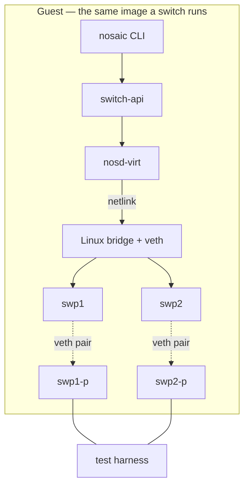
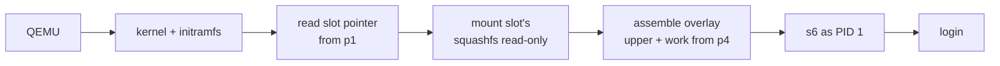

# virt-x86_64 — hardware reference

There is no hardware. That makes this page short, and it makes the parts that
*are* here the load-bearing ones: the disk layout, the boot chain and the port
map are identical to what a real switch gets, because they are produced by the
same code. Only the silicon is stubbed.

## At a glance

| | |
|---|---|
| ASIC | `virt` — veth pairs behind a Linux bridge |
| CPU / arch | x86_64, emulated by `qemu-system-x86_64` |
| RAM | 1 GiB, set by the boot harness |
| Front panel | `swp1`…`swpN`, each one end of a veth pair |
| Management | QEMU's user networking |
| Bootloader | none — QEMU is given the kernel, initramfs and disk |
| Console | `ttyS0`, on your terminal |

## Block diagram



`nosd-virt` is a real `switch-api` implementation, not a mock. It declares
`provides: [nosd]` exactly as a silicon daemon does, so the provider-resolution
mechanism is exercised in CI before any real ASIC depends on it. The CLI, the
config model and the HAL are all genuinely driven; the ASIC is the only thing
replaced.

## Disk layout

Produced by the same code that partitions a real board's flash.

```
p1  nosaic-boot     32 MiB   ext2, journal-less
p2  nosaic-slot-a   96 MiB   image.sqsh, read-only
p3  nosaic-slot-b   96 MiB   image.sqsh, read-only
p4  nosaic-data    256 MiB   ext4, shared across both slots
```

Two decisions here are not arbitrary, and both were bugs first:

- **The boot partition is ext2, not ext4.** The slot pointer is written with
  `debugfs`, and an ext4 journal replay at the next mount silently reverted it —
  the pointer was written, then quietly undone, and the box booted the old slot
  with nothing to say why.
- **A filesystem is sized to its real partition.** A 256 MiB filesystem was once
  written into a 254 MiB partition, over the backup GPT.

## Boot chain



**The slot pointer is read by NOSaic's own initramfs, not by a bootloader.**
That is what makes A/B behave identically on every board: GRUB, Aboot and U-Boot
disagree about almost everything, but none of them is asked to choose a slot.

Each step announces itself on the console (`NOSAIC-INITRAMFS …`,
`NOSAIC-BOOT …`), which is what the automated boot test asserts on.

## Port map

`swpN` is one end of a veth pair; `swpN-p` is the far end, which the test
harness holds. The bridge has VLAN filtering enabled, because it changes how
addresses behave on a port and a bridge without it would be a friendlier
datapath than any real switch.

The translation from name to port lives in the port map and nowhere else — the
same rule a silicon board follows. On real hardware this is where an assumption
gets expensive: if the physical-index rule differs between cage types, code that
assumes one rule mis-maps the other and it presents as a dead port rather than
as a wrong index.

## Register and memory regions

None. There is no chip.

On a silicon board this section carries the regions NOSaic touches, what each is
used for, and anything surprising about access — width, ordering, a path that
silently drops writes, a block that must be brought up before another answers.
It describes *our* use of the region. A table transcribed from a vendor header
belongs to that vendor; the SDK is referenced by `file:line` and never copied in.

## Datapath

`nosd-virt` implements `switch-api` over netlink. Capabilities are advertised
honestly: what the Linux bridge cannot do is reported as unsupported rather than
silently doing less. That is the behaviour the contract exists to enforce, and
this board is where it is tested.

## Platform HAL

Stubbed. There are no sensors, fans, PSUs or transceivers to read, and the HAL
says so rather than inventing plausible numbers — a HAL that returns a
believable temperature for hardware that does not exist would make every
consumer of it untestable.

## Quirks

- **`lib64` is a symlink to `lib`, and losing it makes the image silently
  unbootable.** A tree walk that lstats the root drops it, and the result is an
  image with no dynamic loader that fails with nothing useful on the console.
- **Writing to `/sbin/init` follows busybox's symlink.** It points at
  `../bin/busybox`, so an unguarded write replaces the 2.4 MB binary with
  whatever was being written.
- **s6-rc has no implicit targets.** A dependency on `network` needs `network`
  to exist as a real oneshot; without it the tree comes up short with no error.

## Reverse engineering

None, and that is the point. The `switch-api` contract was defined here
precisely because there was no vendor implementation to imitate — the single
most likely way this project ends up back where EdgeNOS is would be letting the
first real ASIC define the contract by accident.
